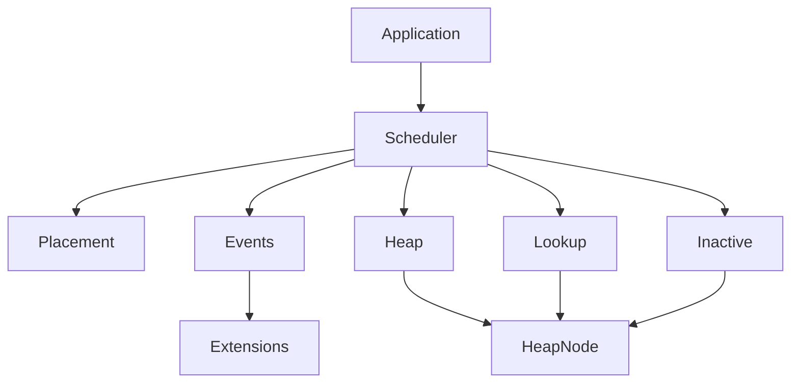
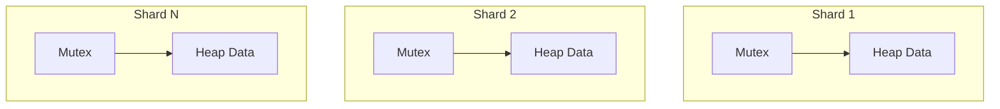
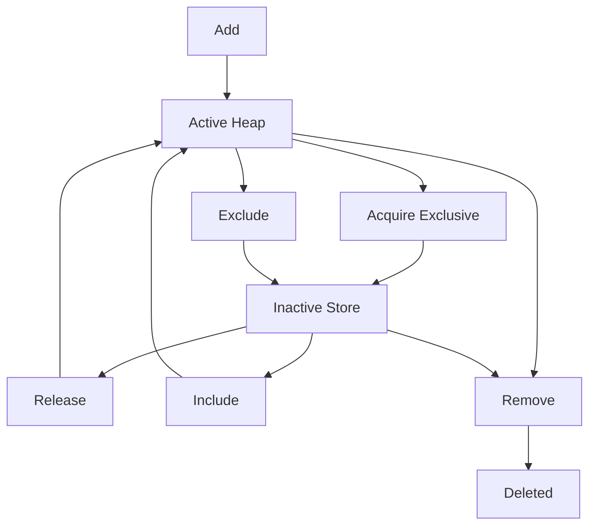
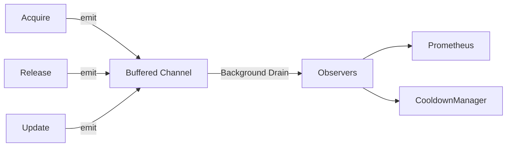

# Architecture

## Component Boundaries

The scheduler is strictly layered. Higher layers depend on lower layers, with no upward dependencies.

## Concurrency Model

The scheduler achieves high throughput by strictly sharding heap locks. There is no global heap mutex. The `Lookup Map` owns its own `sync.RWMutex`, entirely separated from the heaps.

## Atomic State Transitions

A resource exists in exactly one location at a time: an active heap or the Inactive Store. Transitions between these states are perfectly atomic.

## Event Dispatcher Pipeline

To maintain O(log N) hot-path performance, telemetry is decoupled. Public methods emit lightweight structs into a buffered channel. A background goroutine drains this channel and invokes `Observer.OnEvent()`.

