# CRS Architecture

## 1. System overview

Concurrent Resource Scheduler (CRS) is a reusable Go library for prioritized resource scheduling. The application owns resource data, identity, business state, and comparison policy. CRS owns priority scheduling, sharding, the Lookup Map, acquire/release mechanics, HeapNode maintenance, and concurrency safety.

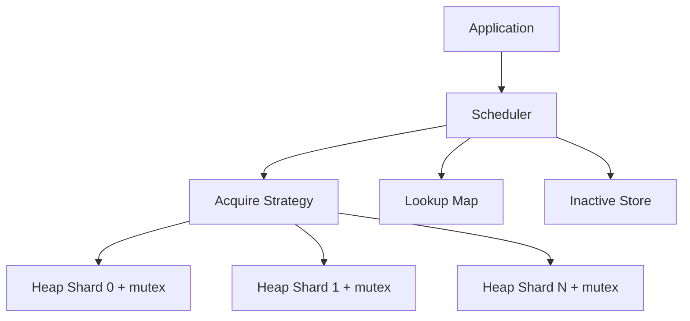

`HeapCount = 1` means one global priority heap: acquire returns its global best resource. `HeapCount > 1` intentionally uses Heap Shards. The scheduler distributes resources across shards internally when they are added. The configured Acquire Strategy chooses which shard `Acquire` queries; acquire returns the selected Heap Shard's best resource, not necessarily the global best. This is a deliberate scalability trade-off. Round Robin is the default and only built-in strategy in v1.

## 2. Design philosophy

- Schedule generic resources only; never own application or provider business logic.
- Use application-owned, stable identity through `KeyFunc(T) ID`; never generate, persist, or expose scheduler IDs.
- Keep runtime metadata private and reconstruct it at each scheduler startup.
- Keep normal operations local to one Heap Shard and its short critical section.
- Keep independent policy responsibilities: Comparator orders resources within a Heap Shard; Acquire Strategy chooses which Heap Shard `Acquire` queries; AcquirePolicy controls Shared versus Exclusive acquire behavior. Internal balanced distribution decides which shard receives a newly added resource and is not configurable.
- Make `AcquirePolicy` immutable so shared versus exclusive behavior is predictable for the scheduler lifetime.

## 3. Responsibilities and non-responsibilities

CRS is responsible for priority scheduling, Heap Shards, invoking Acquire Strategy, the Lookup Map, HeapNode maintenance, active/inactive runtime location, acquire/release behavior, and thread safety. It never directly depends on Round Robin.

CRS is not responsible for rate limiting, health checks, business statuses, provider logic, networking, storage, HTTP, authentication, metrics exporting, resource execution, or leases beyond the Exclusive acquire/release mechanic.

CRS defines only two runtime locations:

- **ACTIVE** — the resource's HeapNode is in one Heap Shard and participates in scheduling.
- **INACTIVE** — the HeapNode is in the Inactive Store. The Inactive Store contains every resource that is temporarily unavailable (e.g., removed by `Exclusive` acquire or by `Exclude`). It simply stores inactive resources together with the information required to restore them to their original heap. The scheduler does not need to know why a resource became inactive, nor does it maintain a "Reason" or "Status". Moving a resource between an active heap and the Inactive Store is always atomic.

Disabled, maintenance, busy, healthy, reserved, and similar concepts belong to the application.

## 4. Package architecture

| Package | Responsibility |
| --- | --- |
| `config` | `HeapCount`, `Comparator`, `KeyFunc`, `AcquirePolicy`, and Acquire Strategy validation. |
| `scheduler` | Public API, lifecycle, and component coordination. |
| `heap` | Heap Shards, internal HeapNodes, heap ordering, and index updates. |
| `placement` | Acquire Strategy contract, read-only placement view, and built-in Round Robin strategy. |
| `lookup` | Application key to internal `*HeapNode` Lookup Map. |
| `stats` | Immutable scheduler snapshots. |
| `errors` | Stable typed/sentinel errors. |
| `internal` | Private helpers only. |

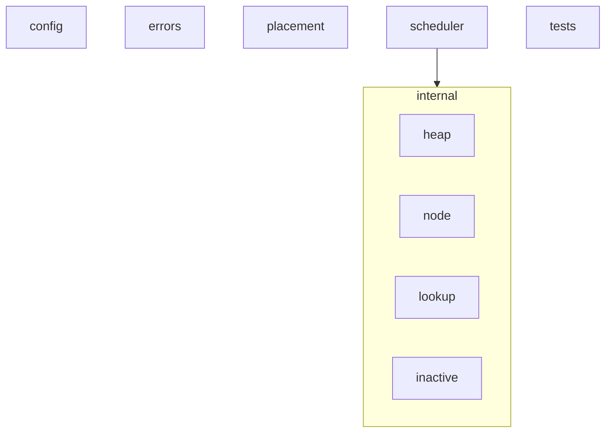

### Layered Architecture
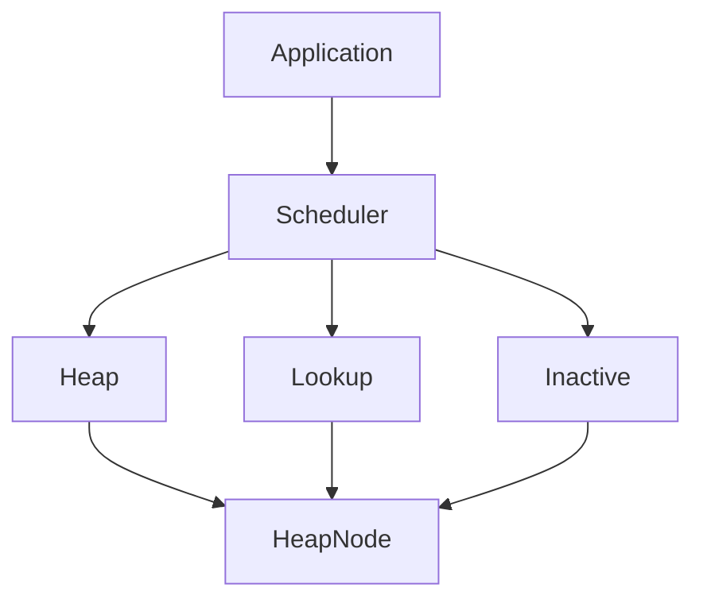
No upward dependencies.

No package exposes HeapNodes, heap indexes, shard IDs, locks, the Lookup Map, placement controls, or the Inactive Store.

## 5. Constructor lifecycle

`New` always performs these five steps in order:

1. **Resolve defaults.** Apply field defaults to the caller's value before any validation:
   - `HeapCount = 0` is resolved to `1`.
   - `AcquireStrategy = nil` is resolved to the built-in Round Robin strategy.
   - `AcquirePolicy` zero value is resolved to `Shared`.
2. **Validate.** After defaults are applied, validate the resolved configuration:
   - `HeapCount` must be greater than zero.
   - `HeapCount` must not exceed an internal implementation maximum. This limit is a private constant that protects against accidental resource exhaustion. Exceeding it returns `ErrInvalidHeapCount (or other specific validation error)` with a descriptive error message. `New` never silently clamps or modifies the caller's value.
   - `Comparator` must be non-nil.
   - `KeyFunc` must be non-nil.
   - `AcquireStrategy` must be present after default resolution.
   - `AcquirePolicy` must be a recognized value after default resolution.
3. **Create runtime infrastructure.** Allocate O(`HeapCount`) Heap Shard state and supporting structures.
4. **Initialize internal components.** Wire the Lookup Map, Inactive Store, and Acquire Strategy together.
5. **Return.** Return a fully ready scheduler and a nil error, or return nil and `ErrInvalidHeapCount (or other specific validation error)`.

If validation fails at step 2, `New` returns an error immediately. No partial scheduler is created. The scheduler is never partially initialized.

## 6. Internal structures

### Phase 2: Heap Subsystem (Internal Design)

The Heap Subsystem introduces the internal data structures and heap implementation that later phases will build upon. No scheduler business logic belongs here.

#### HeapNode

`HeapNode` is the internal runtime metadata struct. It contains:

- `Value T`
- `Key ID`
- `Index int`
- `ShardID int`
- `IsActive bool`

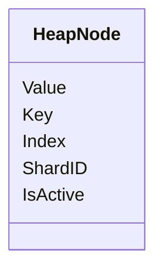

#### HeapNode Field Responsibilities

- **Value**: Stores the user-provided resource directly (never forcing pointer types). If applications want pointer semantics, they instantiate `Scheduler[*MyType]`. HeapNodes are created only during `Add()` or `BatchAdd()` and are never created empty.
- **Key**: Cached application key, used heavily by the Lookup subsystem.
- **Index**: The current heap array position. Maintained by `Swap()`, `Push()`, and `Pop()`. This enables O(log n) `heap.Fix()` and `heap.Remove()`.
- **ShardID**: The original Heap Shard assignment. It never changes after insertion and is used by `Release()` and `Include()` to restore the resource to its original shard.
- **IsActive**: Scheduler-owned metadata indicating whether the node currently belongs to an ACTIVE Heap Shard or the INACTIVE Store. This is NOT the application's resource state (users may have their own State inside `T`).

#### HeapNode Invariants

Every HeapNode:
- has exactly one Lookup entry,
- belongs to exactly one Heap Shard,
- is either ACTIVE or INACTIVE,
- ACTIVE nodes exist only inside a Heap Shard,
- INACTIVE nodes exist only inside the Inactive Store,
- Key never changes,
- ShardID never changes,
- Index is valid only while ACTIVE.

#### HeapNode Ownership

A `HeapNode` is allocated exactly once during `Add()` or `BatchAdd()`. The same `HeapNode` pointer is shared between the Heap, the Lookup Map, and the Inactive Store. The scheduler never creates duplicate HeapNodes for the same resource. Node fields are mutated in place throughout the resource's lifetime. This guarantees there is a single canonical object representing each resource. `Update()`, `Acquire()`, `Release()`, `Exclude()`, and `Include()` all operate on that same node, avoiding synchronization problems and duplicate state.

#### Lookup Design

The Lookup subsystem stores `map[ID]*HeapNode`. It never duplicates HeapNodes. Lookup always stores pointers to the canonical `HeapNode`.

#### Heap Operations

The `heap.Fix()` operation is:
- Only used for ACTIVE nodes.
- Called after `Update()`.
- Never called for INACTIVE nodes (inactive nodes simply replace `Value`).

#### Package Ownership

- `internal/node`: Owns `HeapNode`, scheduler metadata, and node invariants.
- `internal/heap`: Owns the Heap implementation, `heap.Interface`, Heap Shard, shard mutex, `Push`, `Pop`, `Peek`, `Remove`, and `Fix`.

**Strict Layering Boundary:**
The `heap` package never performs scheduler validation. Its *only* job is maintaining heap invariants. The `heap` package does not know about duplicate keys, `AcquirePolicy`, active vs inactive transitions, the Lookup Map, or public operations like `Exclude`/`Include`/`Release`.

*   **Scheduler Layer:** Validates operations, checks policies, checks `IsActive`, talks to the Lookup Map, talks to the Inactive Store, and calls `heap`.
*   **Heap Layer:** Executes `Push`, `Pop`, `Peek`, `Fix`, `Remove`, and maintains comparator-based ordering. It never inspects scheduler state.

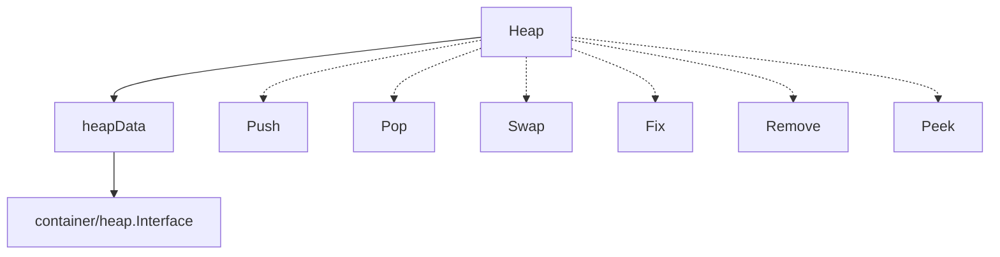

There are no import cycles. Responsibilities are strictly separated.

#### Concurrency

Locking strictly belongs to Heap Shards. HeapNodes never own mutexes. Scheduler operations must lock the owning Heap Shard before mutating the heap.

### Lookup Map and Inactive Store

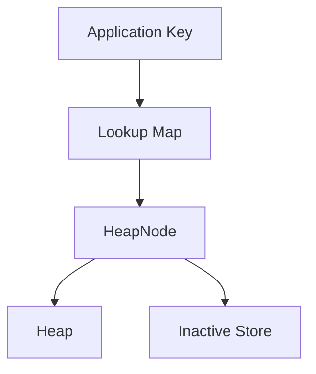

### Strict Lock Ordering

To prevent deadlocks, the scheduler enforces a strict global lock acquisition order: **Lookup Mutex -> Heap Shard Mutex**.

Because most operations (`Update`, `Remove`, `Release`) receive an application key and must determine the node's `ShardID` before locking the shard, they naturally acquire the Lookup Map first. 
- **Rule**: A goroutine holding a Heap Shard mutex must **never** attempt to acquire the Lookup Map mutex.
- **Rule**: A goroutine holding the Lookup Map mutex **may** acquire a Heap Shard mutex.

## 7. Acquire policy and flows

### Acquire flow overview

`Acquire` returns the highest-priority available resource according to the configured AcquireStrategy and AcquirePolicy. It never modifies resource priority, never rebalances heaps, and never recalculates comparator ordering. It only selects and acquires. It always trusts the existing heap ordering; if application data affecting priority has changed, the application must call `Update`.

For every acquire, the scheduler asks AcquireStrategy for the next candidate shard, locks only that shard, and checks whether it is non-empty. If the shard is empty, the scheduler unlocks it and asks AcquireStrategy for the next candidate, repeating until a non-empty shard is found or every shard has been inspected exactly once. If all shards are empty, `Acquire` returns `ErrNoResourceAvailable`. At no point does the scheduler hold more than one shard mutex.

AcquireStrategy does not know whether a shard is empty, inspect heap contents, evaluate resource priority, or observe any other scheduler state. Its only responsibility is selecting the next candidate shard. The scheduler determines whether the returned shard is usable.

### Shared acquire

`Shared` leaves the selected HeapNode ACTIVE. Multiple concurrent callers may receive the same resource deliberately.

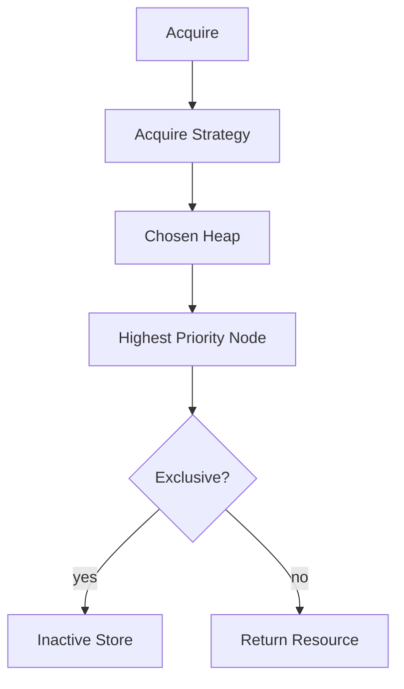

### Exclusive acquire

`Exclusive` removes the selected HeapNode from its Heap Shard and places it in the Inactive Store. It cannot be acquired again until release.

With `Exclusive`, the acquired resource remains unavailable for further scheduling until `Release` is called. An empty selected shard triggers the retry loop; only when every shard has been inspected and all are empty does `Acquire` return `ErrNoResourceAvailable`.

### Release flow

`Release(key)` accepts the application key of the exclusively acquired resource. The scheduler looks up the key in the Inactive Store, reads the original Heap Shard ID from the stored HeapNode, locks that shard, reinserts the node, removes it from the Inactive Store, and unlocks. AcquireStrategy is never consulted; the resource always returns to its original shard. If the scheduler's `AcquirePolicy` is `Shared`, `Release` returns `ErrNotExclusive` immediately without reading any state.

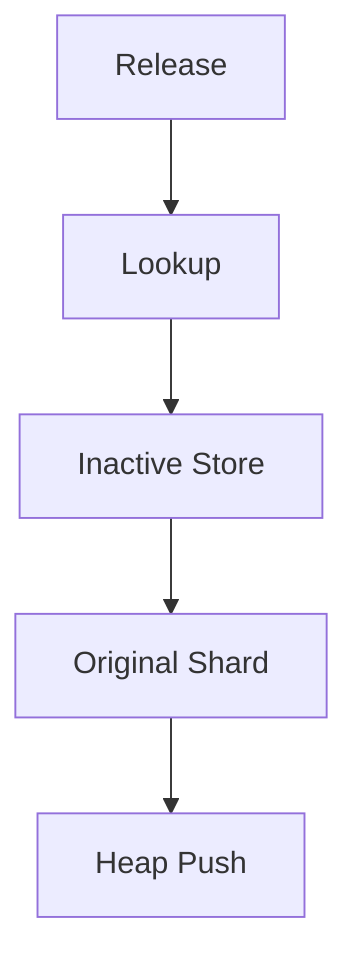

### Add, Update, Remove, Exclude, and Include

`Add` creates an internal HeapNode for a single resource. Before modifying any state it (1) rejects nil resources, (2) calls `KeyFunc` to derive the application key, (3) checks the Lookup Map for a duplicate, and (4) selects a target Heap Shard through the scheduler's internal balanced distribution. If any step fails the scheduler state is unchanged. Insertion is atomic.

`BatchAdd` is initialization-only and inserts a collection of resources atomically. It operates in two strictly ordered phases:

- **Phase 1 (full validation, no state changes):** Reject any nil element, call `KeyFunc` for every element, detect duplicates within the incoming slice itself, then check every derived key against the existing Lookup Map. If any check fails, the scheduler state remains exactly as it was before the call.
- **Phase 2 (insertion, only reached if Phase 1 passes entirely):** Assign each resource to a Heap Shard via the scheduler's internal balanced distribution, create and push each HeapNode, and register it in the Lookup Map.

Neither `Add` nor `BatchAdd` consults AcquireStrategy; shard assignment is an internal implementation detail and is not configurable. `BatchAdd` is not equivalent to calling `Add` in a loop; its implementation may apply bulk heap-building optimizations, but its observable behavior and error guarantees are the same as `Add`.

`Update` replaces an existing resource with its latest state. It is a full replacement operation, not a patch: the scheduler stores the new resource object exactly as provided and never merges fields. `Update` derives the key by calling `KeyFunc(resource)`; the key must match an already-registered resource, because resource identity is immutable — the key cannot be changed by `Update`. If a different key is needed, the caller must call `Remove` then `Add`.

- **ACTIVE path:** Lock only the owning Heap Shard, replace the stored resource value in the existing HeapNode, call `heap.Fix()` at the node's current index to restore comparator-defined ordering, then unlock. No remove/reinsert and no new HeapNode is created.
- **INACTIVE path (Inactive Store):** Replace the stored resource value inside the Inactive Store entry. No heap operation is performed and no shard is locked. When `Release` is later called, the updated value is reinserted with correct ordering.

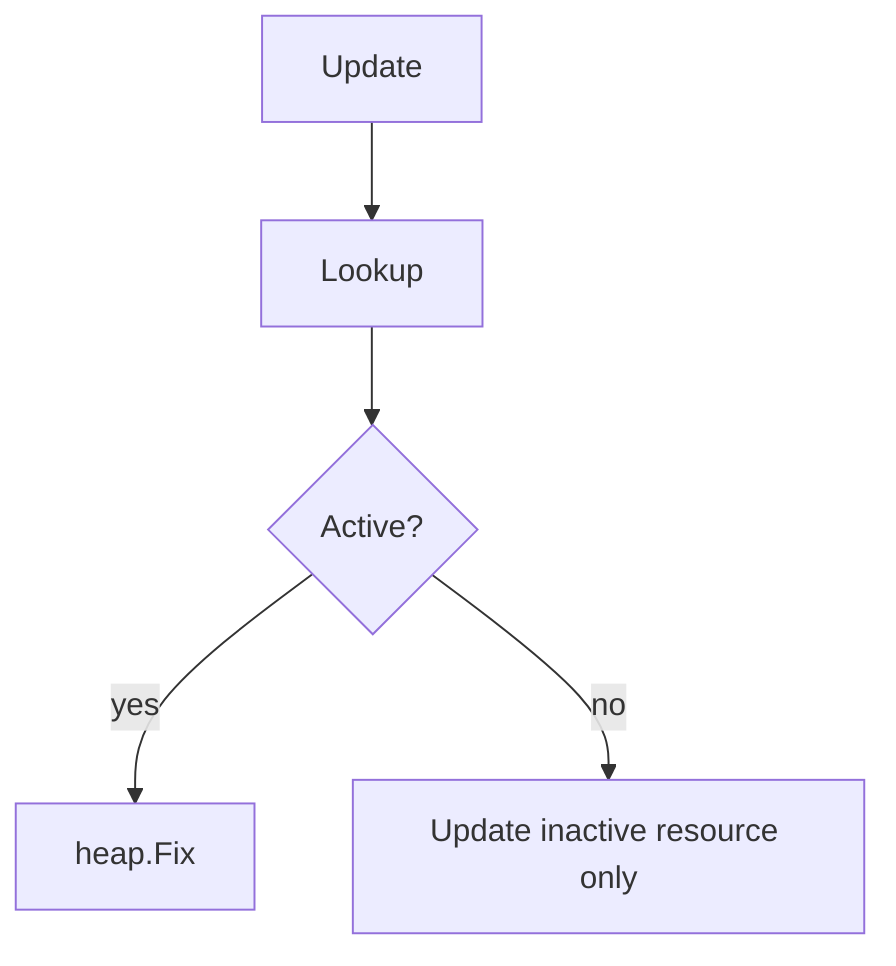

If any step of `Update` fails, the original resource value, heap ordering, and Inactive Store state are unchanged. `Update` never consults AcquireStrategy and never moves a resource between heaps.

`Remove` permanently unregisters a resource from the scheduler, regardless of its current runtime location. It accepts only the application key; no resource object is required.

- **ACTIVE path:** Lock only the owning Heap Shard, remove the HeapNode from the heap using its stored heap index (no Comparator is called), remove the Lookup Map entry, then unlock.
- **INACTIVE path (Inactive Store):** Remove the HeapNode from the Inactive Store (no shard is locked, no Comparator is called), then remove the Lookup Map entry.

`Remove` is atomic: if any internal step fails, heap membership, Inactive Store membership, and the Lookup Map entry all remain consistent and unchanged. `Remove` behaves identically regardless of `AcquirePolicy`; resources may be removed whether ACTIVE or currently held INACTIVE in the Inactive Store. `Remove` never consults AcquireStrategy.

`Exclude` removes an ACTIVE resource from its Heap Shard and places it in the Inactive Store. It locks only the owning Heap Shard and performs the move atomically. No Comparator or AcquireStrategy is called. This represents an application's intention to temporarily pause a resource (e.g., for maintenance).

`Include` returns a previously excluded resource back to its original Heap Shard. It performs the exact same internal operation as `Release`, but is paired with `Exclude` to represent the application's intention to resume a paused resource. Moving the resource between the Inactive Store and the active heap is always atomic.

### Resource Lifecycle
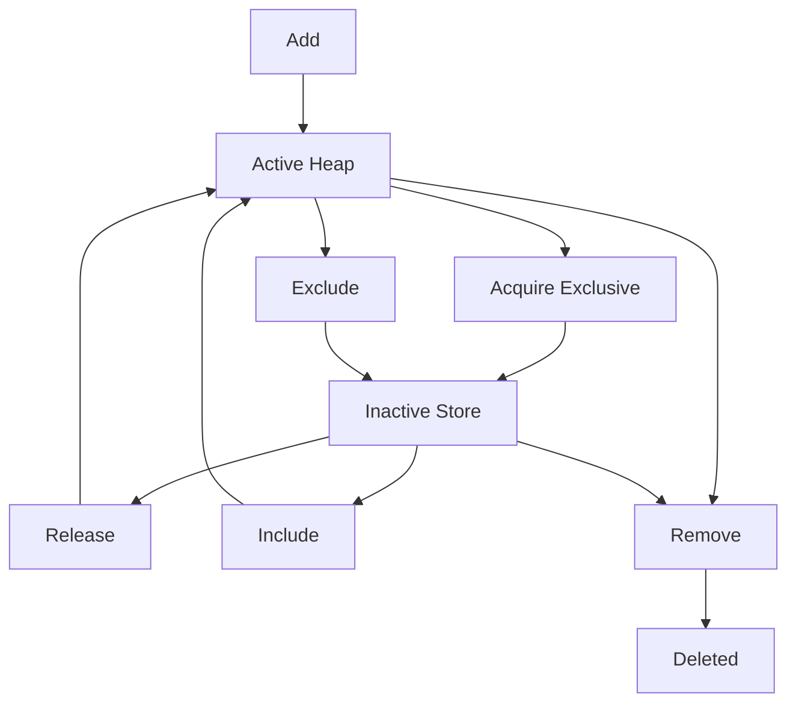

### Query APIs (Get, Len, Stats)

`Get`, `Len`, and `Stats` are read-only operations. They never modify scheduler state, never change heap ordering, and never call AcquireStrategy or Comparator.

- `Get` accepts a resource key, looks up the resource using the Lookup Map, and returns it (or `ErrResourceNotFound`). It executes in O(1).
- `Len` returns the total number of resources currently managed by the scheduler (active plus inactive). It executes in O(1).
- `Stats` returns a lightweight, read-only snapshot of the scheduler's runtime state (including `HeapCount`, `TotalResources`, `ActiveResources`, `InactiveResources`, `EmptyHeaps`, `NonEmptyHeaps`, `AcquireStrategy`, `AcquirePolicy`, and `HeapSizes`). It never exposes all resources, active/inactive lists, internal HeapNodes, the Lookup Map, or Inactive Store contents. `Stats` executes in O(H), where H is the number of heap shards, since it may inspect each heap to produce heap-level information.

## 8. Acquire Strategy

Acquire Strategy has exactly one responsibility during `Acquire`: select the next candidate Heap Shard for the scheduler to inspect. It does not know whether a shard is empty, inspect heap contents, evaluate resource priority, or observe any other scheduler state. The scheduler determines whether the returned shard is usable. If the shard is empty, the scheduler skips it and asks Acquire Strategy for the next candidate.

Shard selection for `Add` and `BatchAdd` is handled internally by the scheduler's balanced distribution logic and is not part of the Acquire Strategy contract.

Round Robin is the default and only built-in v1 implementation. Future random, least-loaded, consistent-hash, and custom user strategies can implement the same boundary without modifying scheduler core logic. Strategies must be thread-safe, non-blocking, and unable to re-enter CRS.

## 9. Concurrency and locking

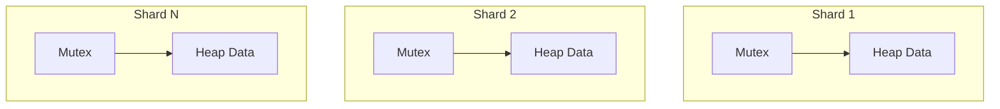

- Each Heap Shard owns a mutex. Normal heap work holds at most one Heap Shard mutex at a time.
- `Acquire` locks only the single selected shard. The retry loop across empty shards releases one shard lock before requesting the next candidate, so the scheduler never holds multiple shard mutexes during acquire.
- Multiple concurrent `Acquire` calls can operate on different Heap Shards simultaneously.
- The Lookup Map lock protects map membership; it never substitutes for a Heap Shard lock or serializes all heap operations.
- The Inactive Store has its own narrowly scoped synchronization.
- `Release` and `Include` lock only the destination (original) Heap Shard; they never lock every shard simultaneously.
- `Update` locks only the single affected Heap Shard when the resource is ACTIVE; when the resource is INACTIVE it uses only the Inactive Store's own synchronization. `Update` never locks multiple shards simultaneously.
- `Remove` locks only the single owning Heap Shard when the resource is ACTIVE; when the resource is INACTIVE it uses only the Inactive Store's own synchronization. `Remove` never locks every shard simultaneously and never calls `Comparator`.
- `Exclude` locks only the single owning Heap Shard when removing the resource.
- A HeapNode changes runtime location atomically with respect to `Acquire`, `Release`, `Exclude`, `Include`, `Update`, and `Remove`; it is never ACTIVE and INACTIVE simultaneously.
- Shared acquisition intentionally allows simultaneous callers to receive the same resource. Exclusive acquisition prevents it until successful release.
- Do not call callbacks, I/O, application work, or logging hooks under scheduler locks.
- The comparator is the constrained exception: it runs during heap mutation under the owning shard lock and must define a strict weak ordering, be deterministic, thread-safe, pure, fast, non-blocking, and unable to re-enter CRS. Comparator panics propagate; CRS does not recover them.
- CRS does not synchronize caller-owned fields. `KeyFunc` and comparator-visible resource state must be race-safe. Callers must avoid lock inversion with scheduler calls.

## 10. Invariants

1. Every registered application key maps to exactly one HeapNode in the Lookup Map.
2. A HeapNode is in exactly one runtime location: ACTIVE in one Heap Shard or INACTIVE in the Inactive Store. Never both.
3. An ACTIVE HeapNode's shard ID and heap index identify its actual membership; an INACTIVE HeapNode in the Inactive Store retains its original shard ID for release.
4. Heap indexes are updated on every node swap, push, fix, and remove.
5. Every ACTIVE Heap Shard satisfies the comparator-defined heap property after each `Add`, `BatchAdd`, `Update` (via `heap.Fix`), `Release`, and `Include`.
6. Only scheduler code mutates HeapNode runtime metadata.
7. Exclusive acquire or `Exclude` removes a node from scheduling before returning it; `Release` or `Include` reinserts it at most once.
8. Failed public mutations preserve all preceding invariants.
9. Runtime shard IDs never appear in the public API or persistent data.
10. Scheduler core obtains acquire-shard decisions only through Acquire Strategy and validates every returned index. If the selected shard is empty, the scheduler skips it and asks Acquire Strategy for the next candidate; this repeats until a resource is found or all shards have been inspected. Shard assignment for `Add` and `BatchAdd` is determined by the internal balanced distribution, not by Acquire Strategy.

## 11. Complexity

| Operation | Complexity |
| --- | --- |
| Lookup Map lookup | O(1) expected |
| Add | O(1) nil + duplicate check plus O(log n) shard insertion |
| BatchAdd | O(k) validation plus O(k log n) shard insertion for k resources |
| Update | O(log n) for ACTIVE node; O(1) for INACTIVE node |
| Remove | O(log n) for ACTIVE node; O(1) for INACTIVE node |
| Acquire, Shared | O(heaps) worst-case empty-shard traversal plus heap peek |
| Acquire, Exclusive | O(heaps) worst-case empty-shard traversal plus O(log n) heap removal |
| Release / Include | O(1) Inactive Store lookup plus O(log n) heap insertion into original shard |
| Exclude | O(log n) heap removal plus O(1) Inactive Store insertion |
| Get / Len | O(1) |
| Stats | O(H) where H is the number of heap shards |

`n` is the affected Heap Shard size. O(heaps) acquire traversal is bounded by `HeapCount`; in practice most acquire calls lock a non-empty shard on the first attempt.

## 12. Failure scenarios

| Scenario | Required behavior |
| --- | --- |
| `HeapCount` is zero or negative after default resolution | Return `ErrInvalidHeapCount (or other specific validation error)` from `New`. |
| `HeapCount` exceeds internal maximum | Return `ErrInvalidHeapCount (or other specific validation error)` from `New` with a descriptive message; never silently clamp. |
| Nil `Comparator` or `KeyFunc`, or unsupported `AcquirePolicy` | Return `ErrInvalidHeapCount (or other specific validation error)` from `New`. |
| Acquire Strategy returns invalid shard index during `Acquire` | Return `ErrInvalidAcquireStrategy`; do not mutate scheduler state. |
| Nil resource passed to `Add` or `BatchAdd` | Return `ErrNilResource` immediately; preserve all scheduler state. |
| Duplicate application key in ACTIVE or INACTIVE location | Return `ErrDuplicateKey`; preserve existing node. |
| Duplicate key within an incoming `BatchAdd` slice | Return `ErrDuplicateKey`; publish none of the batch. |
| Selected shard is empty during `Acquire` | Unlock shard; ask AcquireStrategy for next candidate; continue retry loop. |
| All shards empty after full retry loop | Return `ErrNoResourceAvailable`; no state is changed. |
| `Release` called when `AcquirePolicy` is `Shared` | Return `ErrNotExclusive` immediately; no state is changed. |
| `Release` or `Include` key not found in Inactive Store | Return `ErrResourceNotFound`; no state is changed. |
| `Release` or `Include` key found but HeapNode is not INACTIVE | Return `ErrResourceNotInactive`; no state is changed. |
| Reinsertion fails during `Release` or `Include` | Resource remains in Inactive Store; scheduler state is unchanged. |
| Concurrent Exclusive acquire/`Exclude` and `Release`/`Include` of same key | Serialize node location transition; preserve exactly-one-location invariant. |
| `Exclude` key not found in Lookup Map | Return `ErrResourceNotFound`; no scheduler state is modified. |
| `Exclude` key found but HeapNode is not ACTIVE | Return `ErrResourceNotActive`; no scheduler state is modified. |
| `Update` with nil resource | Return `ErrNilResource` immediately; no scheduler state is modified. |
| `Update` key not found in Lookup Map | Return `ErrResourceNotFound`; original resource and heap ordering unchanged. |
| `Update` fails during `heap.Fix` | Original resource value restored; heap ordering unchanged; scheduler state unchanged. |
| Concurrent `Update` and `Acquire` on same ACTIVE node | Serialize under owning shard lock; heap ordering remains consistent. |
| `Remove` key not found in Lookup Map | Return `ErrResourceNotFound`; no scheduler state is modified. |
| Partial deletion during `Remove` | Prohibited: heap, Inactive Store, and Lookup Map must remain consistent; operation is rolled back to pre-call state. |
| Concurrent `Remove` and `Acquire` on same ACTIVE resource | Serialize under owning shard lock; exactly one wins; the other sees `ErrResourceNotFound` or an empty shard. |
| Comparator or KeyFunc panic | Propagate panic while deferred cleanup releases locks. |
| Shutdown race | Operation completes normally or returns `ErrSchedulerClosed`; no partial node move occurs. |

## 13. Future extension points

Future placement strategies may include random, least-loaded, consistent-hash, and custom user strategies through the stable Acquire Strategy boundary. Other deferred extensions include adaptive balancing, sticky selection, and metrics exporters. Any extension must preserve application-owned identity and business state, private HeapNode metadata, bounded locking, and API stability.

## 14. Rejected architectures

- Automatic resource-field identity lookup or scheduler-generated IDs: couples CRS to resource layouts and destroys application identity ownership.
- Scheduler business status enums: conflates runtime location with application policy.
- One global mutex around all Heap Shards: defeats sharding's contention benefit.
- Exposed HeapNodes, indexes, shard IDs, or Lookup Map entries: lets callers violate invariants.
- Hardcoded Round Robin in scheduler core: prevents placement evolution and couples coordination to one policy.
- Cross-shard global scan on every acquire: changes the explicit sharded scheduling contract.
- User callbacks under locks: risks deadlocks, re-entry, and unbounded latency.

## 15. API stability

v1 avoids breaking public API changes. New functionality should be additive whenever possible; breaking changes are reserved for a future major version. Internal structures and runtime metadata may change without notice. Acquire Strategy is the stable extension boundary for placement policies.

## 16. Strict Implementation Rules

### Implementation Principles
The architecture is now frozen. Every implementation decision must respect the finalized API and architecture. If an implementation problem is encountered:
1. First attempt to solve it internally.
2. Do NOT modify the public API.
3. Do NOT redesign the architecture.
4. Only propose an architecture change if there is absolutely no reasonable internal solution.

### Phase-Based Development
The scheduler must be implemented strictly in phases. Never implement the entire scheduler in one step. Complete one phase before beginning the next. Every phase must be internally complete, reviewed, tested, documented, and stable before moving to the next phase.

### Layered Architecture
Implementation must follow the layered architecture already documented. Examples include Configuration Layer, Validation Layer, Core Types, Internal Data Structures, Heap Layer, Lookup Layer, Inactive Store Layer, Acquire Strategy Layer, Scheduler Core, Public APIs, and Testing Layer. Lower layers must never depend on higher layers. Dependencies should always flow from higher-level components toward lower-level reusable components.

### Modular Project Structure
The project must be highly modular. Every responsibility should have its own package/file whenever practical. Avoid large files containing unrelated functionality. Examples: `/config`, `/errors`, `/internal/heap`, `/internal/node`, `/internal/lookup`, `/internal/inactive`, `/internal/placement`, `/internal/validation`, `/internal/scheduler`, `/types`, `/interfaces`, `/utils`. Every reusable component should have a single implementation shared across the entire project. Never duplicate logic.

### Error Handling
All exported scheduler errors must be defined in one dedicated package/file. Every package should reuse those shared errors. Never redefine identical errors in multiple files.

### Shared Types
All common enums, constants, interfaces, helper types, and reusable structures should live in dedicated shared packages. Avoid duplicated type definitions.

### Small Responsibilities
Every package, file, and type should have one clear responsibility. Follow the Single Responsibility Principle. Avoid "god files" and "god structs."

### Code Style
Write production-quality Go. Prioritize readability, maintainability, simplicity, consistency, idiomatic Go, low coupling, and high cohesion. Prefer composition over unnecessary abstraction. Avoid clever implementations that reduce readability.

### Comments
Every exported type, function, interface, constant, and package must include proper GoDoc comments. Complex algorithms should include implementation comments explaining why the code exists, why the algorithm works, important concurrency guarantees, locking strategy, complexity, and important invariants. Avoid obvious comments. Write comments that help future maintainers understand the design.

### Concurrency
Concurrency-sensitive code should be clearly documented. Explain lock ownership, lock scope, why locking is required, and what invariants are protected. Avoid hidden concurrency assumptions.

### Testability
Every implementation decision should make future unit testing straightforward. Keep components loosely coupled. Prefer dependency injection where appropriate. Avoid tightly coupled implementations.

### Consistency
Naming conventions, file organization, package structure, and documentation should remain consistent across the entire project.

### Phase Transitions
Before starting any new implementation phase, review the architecture documents, review the implementation rules, verify the previous phase is complete, and ensure no public API has changed. Never begin a new phase without validating the previous one.

### Long-Term Maintainability
Assume this project will be maintained by engineers who have never seen the code before. Optimize for easy navigation, easy debugging, easy extension, easy testing, easy code review, minimal duplication, and long-term maintainability. Every implementation decision should favor clarity over short-term convenience. The final codebase should feel like a production-quality open-source Go library rather than a prototype.
