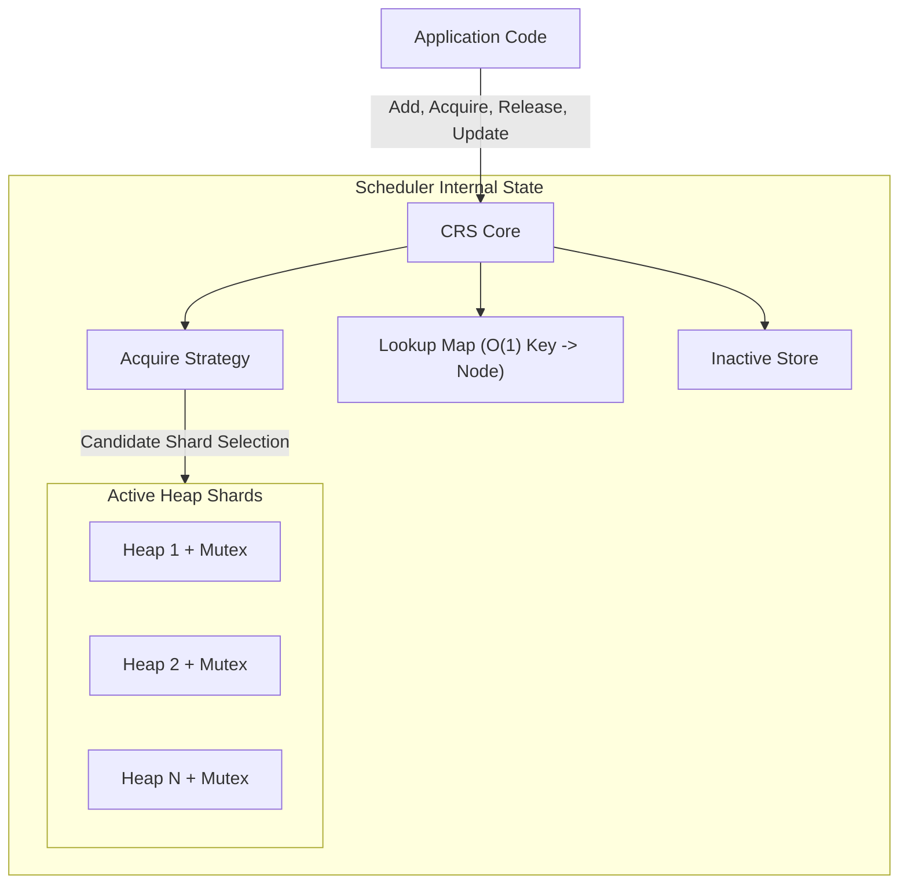

# Concurrent Resource Scheduler (CRS) - Executive Overview

This document provides a concise, high-level summary of the CRS architecture, its core operational flows, the strict implementation rules governing its development, and the phased roadmap we are following.

## 1. Architectural Overview

CRS is a domain-agnostic, high-performance Go library for scheduling prioritized, reusable resources concurrently. It delegates business logic (priority scoring, resource health) to the application and focuses solely on **thread-safe priority queue maintenance and sharding**.

### Core Components:
- **Heap Shards:** Resources are distributed across multiple independently locked heaps. This eliminates the global lock bottleneck.
- **Lookup Map:** An O(1) map linking an application-provided key (derived via `KeyFunc`) to an internal `HeapNode`.
- **Inactive Store:** A single holding pool for resources that are temporarily removed from scheduling (e.g., exclusively acquired or manually excluded).
- **Acquire Strategy:** An abstraction (default: Round Robin) consulted **only** during `Acquire` to determine which Heap Shard to query next.

---

## 2. Core Flows

- **Add / BatchAdd:** The resource is validated, assigned an application key via `KeyFunc`, checked for duplication in the Lookup Map, and internally distributed to a target Heap Shard.
- **Acquire:** The scheduler asks the Acquire Strategy for a candidate shard, locks that shard, and checks for available resources. 
  - If `AcquirePolicy` is `Shared`, the resource stays in the heap.
  - If `AcquirePolicy` is `Exclusive`, the resource is atomically removed from the heap and placed in the **Inactive Store**.
- **Release:** Returns an exclusively acquired resource to the scheduler. It looks up the resource in the Inactive Store, retrieves its original Shard ID, locks that specific shard, and reinserts it.
- **Exclude / Include:** `Exclude` manually moves a resource to the Inactive Store (e.g., for maintenance). `Include` restores it to its original shard.
- **Update:** If ACTIVE, updates the resource value and calls `heap.Fix()` to restore priority ordering under the shard lock. If INACTIVE, simply updates the stored value in the Inactive Store.
- **Get / Len / Stats:** Read-only O(1) or O(H) operations that safely snapshot scheduler state without mutating it.

---

## 3. Strict Implementation Rules

The project enforces highly rigorous development standards to ensure production-grade stability:

1. **Frozen Architecture:** No changes to public APIs or architectural design without absolute necessity.
2. **Phase-Based Development:** Never implement the whole system at once. Each phase must be internally complete, tested, and reviewed before the next begins.
3. **Layered & Modular Design:** Lower layers never depend on higher layers. Use single-responsibility packages (`/config`, `/heap`, `/lookup`, `/placement`, `/scheduler`). Avoid god files.
4. **Locking & Concurrency:** Never use a global heap lock. Locks apply only to a single Heap Shard or the internal maps. Never execute caller-provided work (except the constrained `Comparator`) under a lock.
5. **Atomic Transitions:** A resource is in exactly ONE location at a time (`ACTIVE` in a shard OR `INACTIVE` in the Inactive Store). Transitions between these states are perfectly atomic.
6. **Error Handling:** All exported errors are centralized and typed. Failed operations must leave the scheduler in a perfectly consistent state.

---

## 4. Development Phases

The project was executed in 4 strictly sequential phases:

- **Phase 1 ✅ Configuration subsystem:** Public APIs, config validation, and error taxonomy.
- **Phase 2 ✅ Indexed heap subsystem:** Internal priority heap and comparator invariants.
- **Phase 3 ✅ Lookup subsystem:** Application key to `HeapNode` mapping.
- **Phase 4 ✅ Scheduler orchestration:** Composing all components into thread-safe operations (`Add`, `BatchAdd`, `Acquire`, `Release`, `Update`, `Exclude`, `Include`, `Get`, `Len`, `Stats`, `Shutdown`), along with rigorous stress and race-test validation.

The remaining post-v1 extensions are planned across the following independent phases:

- **Phase 5 (Deferred) — Advanced Placement Strategies:** Expand placement mechanisms with consistent hashing, weighted selection, adaptive load balancing, and a dedicated sticky selection API.
- **Phase 6 (Deferred) — Scheduler Hooks & Extension APIs:** Provide lifecycle callbacks and event notifications, allowing applications to build their own cooldowns, circuit breakers, and health managers without leaking business logic into the core scheduler.
- **Phase 7 (Deferred) — Observability & Metrics:** Expose the scheduler's internal state to industry-standard monitoring systems (e.g., Prometheus) using O(H) stats snapshots.

---

## 5. Core Design Invariants

- A resource exists in exactly one location at a time: an active heap or the Inactive Store.
- Every resource has exactly one Lookup Map entry linking it to a `HeapNode`.
- Every `HeapNode` inherently belongs to exactly one heap shard.
- Public APIs are fully thread-safe and safe for highly concurrent usage.
- Heap ordering is determined **solely** by the user-provided, strict weak ordering `Comparator`.
- Resource identity (derived via `KeyFunc`) is absolutely immutable after insertion.
- Heap Shards are entirely independent and **never** require a global scheduler heap lock.
