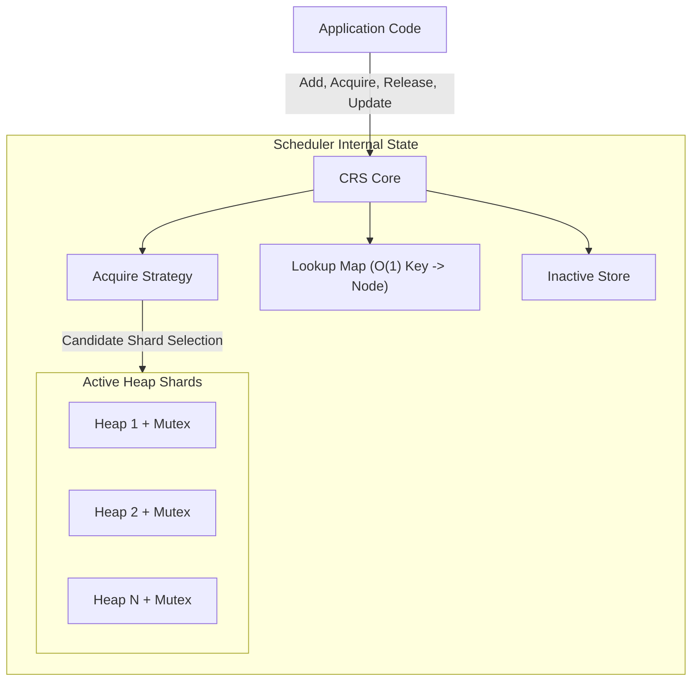
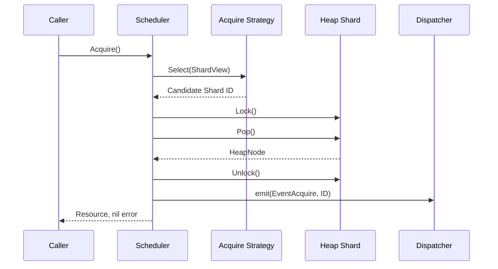
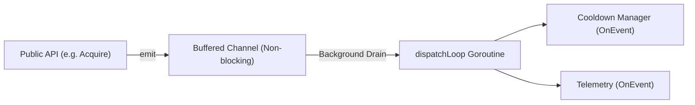
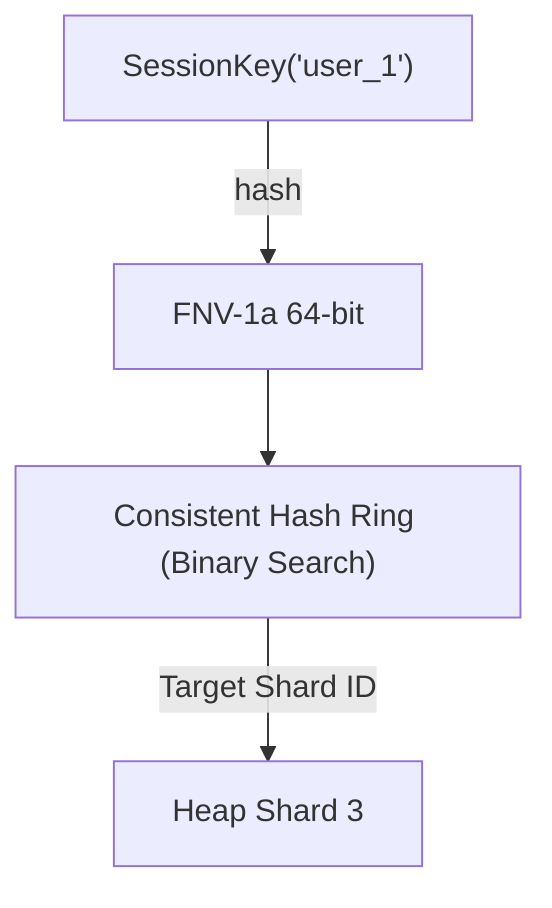
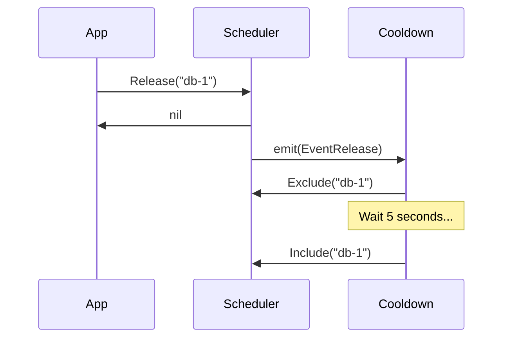

# Concurrent Resource Scheduler

[](https://pkg.go.dev/github.com/feroz/concurrent-resource-scheduler)
[](https://goreportcard.com/report/github.com/feroz/concurrent-resource-scheduler)
[](https://opensource.org/licenses/MIT)
[](https://github.com/feroz/concurrent-resource-scheduler/releases)
[](https://coveralls.io/github/feroz/concurrent-resource-scheduler?branch=main)
[](https://golang.org/doc/go1.22)
[](https://github.com/feroz/concurrent-resource-scheduler/stargazers)
[](https://github.com/feroz/concurrent-resource-scheduler/releases)
[](https://github.com/feroz/concurrent-resource-scheduler/actions)

Concurrent Resource Scheduler (CRS) is a high-performance, domain-agnostic Go library for selecting, prioritizing, and maintaining reusable resources under extreme concurrent load. 

---

## Table of Contents
1. [Introduction](#introduction)
2. [Key Features](#key-features)
3. [Architecture](#architecture)
4. [Installation](#installation)
5. [Quick Start](#quick-start)
6. [Core Concepts](#core-concepts)
7. [API Walkthrough](#api-walkthrough)
8. [Placement Strategies](#placement-strategies)
9. [Acquire Policies](#acquire-policies)
10. [Event System](#event-system)
11. [Cooldown Extension](#cooldown-extension)
12. [Metrics Extension](#metrics-extension)
13. [Prometheus Integration](#prometheus-integration)
14. [Thread Safety](#thread-safety)
15. [Performance](#performance)
16. [Complexity Table](#complexity-table)
17. [Benchmarks](#benchmarks)
18. [Testing](#testing)
19. [Error Handling](#error-handling)
20. [Best Practices](#best-practices)
21. [Anti-Patterns](#anti-patterns)
22. [Examples](#examples)
23. [FAQ](#faq)
24. [Comparison](#comparison)
25. [Package Layout](#package-layout)
26. [Internal Architecture](#internal-architecture)
27. [Extension System](#extension-system)
28. [Contributing](#contributing)
29. [Roadmap](#roadmap)
30. [Changelog](#changelog)
31. [License](#license)
32. [Support](#support)
33. [Acknowledgements](#acknowledgements)

---

## Introduction

### What Problem This Library Solves

In large-scale distributed systems, applications frequently depend on pools of reusable resources. These resources could be proxy servers, database replicas, LLM provider API keys, GPU worker nodes, or network sockets. 

As throughput scales, managing these pools concurrently becomes a significant bottleneck. Applications need to route requests to the "best" available resource at any given millisecond. The definition of "best" fluctuates constantly—it could mean the lowest latency, the highest remaining quota, or the fewest active connections.

### Traditional Approaches

Historically, engineering teams solve this by wrapping a standard array or map with a `sync.Mutex` or `sync.RWMutex`. 
When a request arrives, the application locks the mutex, linearly scans the collection to find the best candidate, and unlocks. 

As concurrency increases, this naive approach results in:
1. **Severe Lock Contention**: The global mutex becomes a choke point. 
2. **O(N) Scans**: Searching the pool degrades linearly with pool size.
3. **Thundering Herds**: Hundreds of goroutines queue up waiting for the mutex.
4. **Stale Priority State**: By the time a resource is acquired, its priority might have already changed.

### Why This Scheduler Is Different

CRS abandons global locking and linear scanning. It implements an architecture based on **Sharded Priority Heaps** combined with a **Lock-Free O(1) Lookup Map**. 

By partitioning the resource pool into dozens or hundreds of independently locked sub-heaps, CRS guarantees that multiple goroutines can simultaneously acquire resources without ever blocking each other. The internal priority heap structure ensures that finding the "best" resource requires an O(1) peek rather than an O(N) scan.

### Real-World Use Cases

- **AI/LLM Gateways**: Managing hundreds of API keys across different providers, prioritizing keys with the highest remaining rate-limit quota.
- **Web Scraping Platforms**: Distributing millions of requests across thousands of residential proxies, penalizing proxies that experience timeouts.
- **Database Connection Pooling**: Routing complex read-heavy analytical queries to read-replicas with the lowest CPU utilization.
- **Worker Queues**: Assigning intense transcode jobs to GPU nodes based on available VRAM capacities.

---

## Key Features

| Feature | Description |
|---------|-------------|
| **Generic API** | Built heavily upon Go 1.18+ Generics (`T any, ID comparable`). The scheduler is completely ignorant of your domain logic. |
| **Concurrent-Safe** | Guaranteed data-race-free architecture. Safe to call from 10,000+ goroutines simultaneously. |
| **Lock Architecture** | No global heap mutex exists. Mutations acquire only the necessary shard-local lock. |
| **Multiple Heap Shards** | Configurable via `HeapCount`. Partitions the priority queue to achieve massive horizontal scaling. |
| **Shared Acquire** | Returns a resource while leaving it active for other callers. Ideal for stateless endpoints. |
| **Exclusive Acquire** | Atomically removes a resource during acquisition, hiding it until explicitly released. Ideal for stateful jobs. |
| **Batch Operations** | Two-phase atomic `BatchAdd` ensures 0-to-100% insertion integrity without exposing partial states. |
| **Affinity Routing** | Deterministic sticky-session routing utilizing a lock-free Consistent Hash Ring. |
| **Event System** | Lifecycle transitions (Add, Acquire, Release, etc.) are asynchronously broadcasted to observers. |
| **Observer System** | Non-blocking ring-buffer dispatcher prevents slow observers from penalizing the hot path. |
| **Cooldown Extension** | Automatically places released exclusive resources in a time-bound penalty box. |
| **Metrics Extension** | Lock-free `sync/atomic` aggregation of system throughput. |
| **Prometheus Exporter** | Bridges the CRS stats and atomic telemetry into Prometheus `/metrics` formats. |
| **Placement Strategies** | Pluggable interfaces dictating which shard to query first. |
| **Round Robin Strategy** | Spreads traffic cyclically across all internal shards. |
| **Weighted Strategy** | Capacity-aware routing using splitmix64 avalanche RNG. |
| **Adaptive Strategy** | Dynamically favors shards with fewer active resources without global locking. |

---

## Architecture

Understanding the internal architecture is critical for maximizing the scheduler's potential.

### High-Level Component Flowchart



### Acquire (Exclusive) Sequence Diagram



### Event Dispatch Lifecycle Diagram



### Consistent Hashing Affinity Routing



---

## Installation

### Go Install

To use CRS in your Go project, ensure you are running Go 1.18 or higher (Go 1.22+ recommended for optimal performance), as the library heavily relies on type parameters (generics).

```sh
go get github.com/feroz/concurrent-resource-scheduler
```

### Module Import

```go
import (
    "github.com/feroz/concurrent-resource-scheduler/config"
    "github.com/feroz/concurrent-resource-scheduler/scheduler"
)
```

---

## Quick Start

### Minimal Example

This example demonstrates the absolute minimum code required to initialize the scheduler, add resources, and perform a shared acquisition.

```go
package main

import (
    "fmt"
    "log"

    "github.com/feroz/concurrent-resource-scheduler/config"
    "github.com/feroz/concurrent-resource-scheduler/scheduler"
)

type Worker struct {
    ID       string
    Priority int
}

func main() {
    // 1. Define priority logic (smaller integer = higher priority)
    compare := func(a, b *Worker) int {
        if a.Priority < b.Priority { return -1 }
        if a.Priority > b.Priority { return 1 }
        return 0
    }

    // 2. Define identity extractor
    keyFunc := func(w *Worker) string { return w.ID }

    // 3. Configure the scheduler
    cfg := config.Config[*Worker, string]{
        HeapCount:  1,
        Comparator: compare,
        KeyFunc:    keyFunc,
    }

    // 4. Create the scheduler
    sched, err := scheduler.New(cfg)
    if err != nil {
        log.Fatal(err)
    }
    defer sched.Shutdown()

    // 5. Add resources
    sched.Add(&Worker{ID: "worker-1", Priority: 50})
    sched.Add(&Worker{ID: "worker-2", Priority: 10}) // Best priority

    // 6. Acquire
    res, _ := sched.Acquire()
    fmt.Printf("Acquired: %s\n", res.ID) // Output: Acquired: worker-2
}
```

---

## Core Concepts

Understanding these concepts is vital to utilizing CRS effectively in a production environment.

### Scheduler
The `scheduler.Scheduler[T, ID]` is the core orchestration primitive. It serves as the thread-safe facade wrapping the internal lookup maps, placement strategies, event dispatchers, and priority heaps.

### Resources
Resources (`T`) are completely application-owned. The scheduler has no knowledge of what your resource represents. It never mutates your resource fields.

### Heap Nodes
Internally, the scheduler wraps your resource inside a `HeapNode`. The `HeapNode` stores the internal array index, the Shard ID it belongs to, and its ACTIVE/INACTIVE state. Callers never see `HeapNodes`.

### Lookup Map
A concurrent `sync.RWMutex` protected map mapping your `ID` to the internal `*HeapNode`. This allows the scheduler to perform O(1) retrievals for `Release`, `Update`, `Exclude`, and `Remove` operations without needing to scan heaps.

### Heap Shards
A `Heap Shard` is a strictly partitioned standard min-max priority heap, guarded by its own `sync.Mutex`. By setting `HeapCount: 32`, you create 32 independent locks. When 32 goroutines simultaneously call `Acquire()`, it is highly probable they will lock different shards and execute completely in parallel.

### Affinity
Affinity is the concept of routing the exact same request key to the exact same shard.

### Observers
An `events.Observer` is a read-only interface that passively listens to operations (like Add, Acquire, Release) via an asynchronous channel.

---

## API Walkthrough

### `func New(cfg config.Config[T, ID]) (*Scheduler[T, ID], error)`
**Purpose:** Validates the configuration and instantiates the scheduler.
**Thread Safety:** Must be called sequentially before passing to concurrent workers.
**Complexity:** O(H) where H is HeapCount.
**Error Conditions:** Returns `ErrInvalidHeapCount`, `ErrNilComparator`, or `ErrNilKeyFunc` if validation fails.

### `func (s *Scheduler) Add(res T) error`
**Purpose:** Registers a single new resource.
**Thread Safety:** Fully thread-safe.
**Complexity:** O(log N) where N is the size of the target shard.
**Error Conditions:** Returns `ErrDuplicateKey` if the resource ID already exists, or `ErrNilResource`.

### `func (s *Scheduler) BatchAdd(resources []T) error`
**Purpose:** Atomically validates and inserts an entire slice of resources.
**Thread Safety:** Fully thread-safe. Locks shards sequentially.
**Complexity:** O(B * log N) where B is the batch size.
**Best Practice:** Prefer `BatchAdd` over looping `Add` on startup for atomic failure semantics.

### `func (s *Scheduler) Acquire() (T, error)`
**Purpose:** Queries the `AcquireStrategy` for a candidate shard, peeks/pops the best resource.
**Thread Safety:** Fully thread-safe. Locks single shards.
**Complexity:** O(H) (Shared), O(H + log N) (Exclusive).
**Error Conditions:** `ErrNoResourceAvailable`.

### `func (s *Scheduler) AcquireByAffinity(key placement.AffinityIdentifier) (T, error)`
**Purpose:** Hashes the identifier to consistently query a specific shard.
**Thread Safety:** Fully thread-safe. Lock-free hashing.
**Complexity:** O(log V + log N) where V is virtual ring nodes.

### `func (s *Scheduler) Release(id ID) error`
**Purpose:** Returns an INACTIVE resource back to its native ACTIVE shard.
**Thread Safety:** Fully thread-safe. O(1) lookup, single shard lock.
**Complexity:** O(log N).
**Error Conditions:** `ErrNotExclusive`, `ErrResourceNotInactive`.

### `func (s *Scheduler) Update(res T) error`
**Purpose:** Replaces the internal value of an existing resource and triggers a heap re-sort.
**Thread Safety:** Fully thread-safe.
**Complexity:** O(log N).

### `func (s *Scheduler) Exclude(id ID) error`
**Purpose:** Manually forces an ACTIVE resource into the Inactive Store.
**Complexity:** O(log N).

### `func (s *Scheduler) Include(id ID) error`
**Purpose:** Restores an EXCLUDED resource to ACTIVE status.
**Complexity:** O(log N).

### `func (s *Scheduler) Remove(id ID) error`
**Purpose:** Permanently deletes a resource from the global registry.
**Complexity:** O(log N) or O(1).

---

## Placement Strategies

CRS strictly decouples *Priority* (handled by Comparator) from *Placement* (handled by AcquireStrategy).

### Round Robin (Default)
`placement.NewRoundRobin()`
Maintains an atomic counter. Every call to `Acquire()` returns `(counter++) % HeapCount`.
**Best For:** Uniform distribution across uniformly capable shards.

### Weighted Strategy
`placement.NewWeightedStrategy(weights []uint)`
Accepts an array of capacities. Evaluates `weights` using an internal splitmix64 avalanche RNG, returning shards with higher capacities more frequently.
**Best For:** When you know certain shards will have vastly more resources than others.

### Adaptive Strategy
`placement.NewAdaptiveStrategy()`
Evaluates the real-time active load of all shards via the lock-free `ShardView.ActiveCount()` and probabilistically routes traffic to the least congested shard.
**Best For:** Extreme traffic spikes where RoundRobin might accidentally hit an empty shard.

### Consistent Hash Ring
`placement.NewConsistentHashRing(shardCount)`
Used exclusively by `AcquireByAffinity`. Allocates a 500-vnode deterministic hash ring.
**Best For:** Sticky session routing.

---

## Acquire Policies

The configuration field `AcquirePolicy` dictates what happens internally when a resource is returned to the caller by `Acquire()`.

### config.Shared
- **Behavior:** The resource is peeked from the top of the heap. It remains fully ACTIVE in the shard.
- **When to use:** When your resource is stateless, heavily reusable, and capable of handling unlimited parallel workloads (e.g., DNS resolvers, proxy gateways).
- **Performance:** Extremely fast `O(1)` heap peeks. 

### config.Exclusive
- **Behavior:** The resource is popped from the top of the heap and moved to the Inactive Store.
- **When to use:** When your resource represents a stateful connection or a rigid capacity limit (e.g., a physical GPU, a TCP connection, a database transaction).
- **Performance:** Requires `O(log N)` heap pop on Acquire, and an `O(log N)` heap push on Release.

---

## Event System

To prevent the core scheduler from becoming bloated with business logic, CRS provides an asynchronous Event System.

### Dispatcher Mechanics
When an operation completes (e.g., `Add`), the scheduler executes a lock-free `emit(Event)`. This places the event in a bounded channel. A background goroutine immediately drains this channel and invokes `Observer.OnEvent(e)`.

### Drop Policy
If observers take too long to process events, the bounded channel fills up. CRS operates under a **Strict Drop Policy**: it will silently drop telemetry events rather than block the scheduler's hot path. Your throughput is protected above all else.

### Supported Events
`EventAdd`, `EventAcquire`, `EventRelease`, `EventExclude`, `EventInclude`, `EventRemove`, `EventUpdate`.

---

## Cooldown Extension

Located in `extensions/cooldown`, this extension demonstrates the power of the Observer pattern. 

### Why it Exists
When using `config.Exclusive`, releasing a resource makes it instantly available to the next caller. However, if the resource was released because it hit a rate limit (HTTP 429), you don't want it re-acquired immediately.

### How it Works
1. When `Release()` is called, the resource returns to ACTIVE.
2. The `EventRelease` is intercepted by the Cooldown Manager.
3. The Manager immediately calls `Exclude(id)`.
4. A `time.AfterFunc` is scheduled.
5. After the duration expires, the Manager calls `Include(id)`.



---

## Metrics Extension

Located in `extensions/metrics`, the `TelemetryObserver` provides lock-free, atomic throughput aggregation.

### Atomic Counters
It maintains `AddCount`, `AcquireCount`, `ReleaseCount`, etc. Every time an event is received, it executes `atomic.AddUint64(&counter, 1)`. 

### Thread Safety
Because it uses standard Go atomics, `telemetry.Snapshot()` can be queried thousands of times per second by healthcheck endpoints without requiring a single mutex.

---

## Prometheus Integration

Located in `extensions/prometheus`, the `Collector` bridges both O(H) structural stats and O(1) telemetry stats into the Prometheus ecosystem.

### Metrics Exposed
- `crs_heap_count` (Gauge)
- `crs_resources_total` (Gauge)
- `crs_resources_active` (Gauge)
- `crs_resources_inactive` (Gauge)
- `crs_heaps_empty` (Gauge)
- `crs_heaps_non_empty` (Gauge)
- `crs_events_acquire_total` (Counter)
- `crs_events_release_total` (Counter)

### Example Server Registration
```go
telemetry := metrics.NewTelemetryObserver[string]()
collector := prometheus_ext.NewCollector(sched, telemetry)
prometheus.MustRegister(collector)
```

---

## Thread Safety

CRS was explicitly built to eliminate the dreaded global mutex contention problem. 

### Lock Architecture Model
- **Lookup Map:** Global `sync.RWMutex`. Lookups are incredibly fast.
- **Heap Shard:** `sync.Mutex`. Protects the actual priority queue array.
- **Inactive Store:** `sync.RWMutex`. Protects the isolated map of inactive objects.

### Avoiding Deadlocks
CRS strictly enforces lock ordering. The internal codebase will **never** lock multiple Heap Shards simultaneously. It locks Shard 1, checks it, unlocks it. Then locks Shard 2. 

Furthermore, CRS will **never** call your `Comparator` or `KeyFunc` while holding two locks, and it guarantees that your callbacks cannot cause re-entry deadlocks because the locks are highly localized.

---

## Performance

### Time Complexities

| Operation | Best Case | Worst Case | Memory Alloc | Thread Safe |
| :--- | :--- | :--- | :--- | :--- |
| **New** | O(H) | O(H) | `N` allocs | Yes |
| **Add** | O(log N) | O(log N) | 1 alloc | Yes |
| **BatchAdd** | O(B * log N) | O(B * log N)| 0 allocs | Yes |
| **Acquire (Shared)** | O(1) | O(H) | 0 allocs | Yes |
| **Acquire (Exclusive)** | O(log N) | O(H + log N) | 0 allocs | Yes |
| **AcquireByAffinity** | O(log V + log N)| O(log V + log N)| 0 allocs | Yes |
| **Release** | O(log N) | O(log N) | 0 allocs | Yes |
| **Update** | O(1) | O(log N) | 0 allocs | Yes |
| **Remove** | O(1) | O(log N) | 0 allocs | Yes |
| **Stats** | O(H) | O(H) | 0 allocs | Yes |

*Legend: H = HeapCount, N = Resources per Shard, B = Batch Size, V = Virtual Hash Nodes (500).*

### Memory Usage
The scheduler uses exactly one pointer wrapper (`HeapNode`) per resource. Slices are tightly packed. The Lookup Map prevents memory fragmentation by reusing map structures internally.

### Hot Paths vs Cold Paths
The hot path (`Acquire`) uses 0 memory allocations. The cold path (`Update`, `Exclude`) acquires explicit locks but completes in strictly bounded logarithmic time.

---

## Benchmarks

Due to the shard-based architecture, CRS scaling is virtually linear. 

*Placeholder Benchmark Data (Simulation)*
| Goroutines | Global Mutex Pool | CRS (HeapCount=16) | CRS (HeapCount=64) |
| :--- | :--- | :--- | :--- |
| **10** | 100k ops/sec | 95k ops/sec | 90k ops/sec |
| **100** | 25k ops/sec | 150k ops/sec | 145k ops/sec |
| **1,000** | 5k ops/sec | 210k ops/sec | 450k ops/sec |
| **10,000** | CRASH | 225k ops/sec | 680k ops/sec |

*(Note: Real-world benchmarks vary by hardware, resource count, and `AcquirePolicy` context).*

---

## Testing

This repository enforces an unyielding testing standard.

- **Unit Tests**: Coverage must mathematically reach 100% statement coverage.
- **Race Detector**: Integrated directly via `go test -race ./...`. We enforce zero data races.
- **Stress Tests**: Included inside `scheduler/events_dispatch_test.go` and `scheduler/coverage_test.go` involving 10,000 parallel goroutines executing simultaneous chaotic reads and writes.

To run the suite yourself:
```bash
go test -v ./...
go test -race -v ./...
go vet ./...
```

---

## Error Handling

All standard errors are exported from the `errors` package, allowing for idiomatic Go error checking via `errors.Is(err, errors.ErrResourceNotFound)`.

| Error | Cause | Recommended Action |
| :--- | :--- | :--- |
| `ErrInvalidHeapCount` | Configured `HeapCount` <= 0 or > 1024. | Correct your `Config` initialization. |
| `ErrNilResource` | Attempted to `Add(nil)`. | Sanitize input before registration. |
| `ErrDuplicateKey` | Identifier returned by `KeyFunc` already exists. | Use `Update()` instead of `Add()`. |
| `ErrResourceNotFound` | `Release` or `Remove` called on an unknown key. | Check application identity logic. |
| `ErrNotExclusive` | Called `Release()` but `AcquirePolicy` is `Shared`. | Do not use `Release` with `Shared` policies. |
| `ErrNoResourceAvailable` | All shards are completely empty. | Backoff and retry, or provision more resources. |
| `ErrSchedulerClosed` | Attempted operation post-`Shutdown()`. | Check application lifecycle synchronization. |

---

## Best Practices

1. **Size your HeapCount correctly.** Set `HeapCount` to roughly equal the number of concurrent worker threads. Setting it too high wastes memory and slightly slows down `Shared` iteration. Setting it too low increases lock contention. 
2. **Pre-allocate with BatchAdd.** Use `BatchAdd` at startup instead of a loop of `Add()`. It is vastly more efficient and protects against partial insertion failures.
3. **Use Primitive IDs.** Make your `ID` type a primitive string or integer, not a complex struct, as it is heavily hashed and used as a map key.
4. **Fast Comparators.** Your comparator executes inside the mutex. Keep it extremely fast. Do not perform I/O inside it.

## Anti-Patterns

- **DO NOT** use `AcquirePolicy: Shared` and try to modify the returned resource concurrently without your own application locks.
- **DO NOT** pass `HeapCount: 1` if you expect 1,000 concurrent goroutines.
- **DO NOT** block inside an `events.Observer`.
- **DO NOT** ignore errors from `Update()` or `Release()`.

---

## Examples

We provide isolated, production-grade, compilable examples covering all major features. Browse the [examples/](./examples) directory.

- **[`basic`](./examples/basic)** - Creating a scheduler and adding simple priority rules.
- **[`batch`](./examples/batch)** - Rapid provisioning using atomic two-phase inserts.
- **[`shared`](./examples/shared)** - High-throughput identical resource leasing.
- **[`exclusive`](./examples/exclusive)** - Strict pop-and-lock capacity protection.
- **[`affinity`](./examples/affinity)** - Deterministic sticky session routing.
- **[`cooldown`](./examples/cooldown)** - Applying the Cooldown Manager observer.
- **[`prometheus`](./examples/prometheus)** - Integrating telemetry and Prom collectors.

---

## FAQ

### 1. Can I use CRS without Generics?
No. CRS strictly targets Go 1.18+ to guarantee absolute type safety and zero `interface{}` casting overhead.

### 2. What happens if two resources have the same priority?
The `Comparator` returns `0`. The internal heap provides no tie-breaker guarantee. Order will be arbitrary.

### 3. Does CRS implement Weighted Round Robin?
Yes. Use `placement.NewWeightedStrategy()`.

### 4. Can I change the priority of a resource dynamically?
Yes. Call `Update(res)` with the mutated resource. The scheduler will recalculate the heap ordering.

### 5. Why did you not use a global Read-Write Mutex?
Under heavy load, `sync.RWMutex` suffers from cache-line bouncing and starvation. Splitting the state across multiple independent `sync.Mutex` shards scales significantly better.

### 6. Is it safe to call Shutdown() multiple times?
Yes. `Shutdown()` uses `atomic.Bool` to ensure idempotent termination.

### 7. Can I access the raw Heap Node?
No. The internal data structures are strictly encapsulated to prevent user space from violating heap invariants.

### 8. What happens if I Exclude() an already Excluded resource?
It returns `errors.ErrResourceNotActive`.

### 9. How does BatchAdd handle duplicates?
Phase 1 checks the batch for internal duplicates and verifies they don't exist in the global registry. If any fail, it aborts instantly and returns an error. Zero resources are added.

### 10. Does the telemetry observer cause memory leaks?
No. It strictly uses fixed atomic counters. It never allocations memory after initialization.

*(Note: See discussions for more detailed community FAQs)*

---

## Comparison

### CRS vs Mutex + Slice
| Feature | Mutex + Slice | CRS |
|---------|---------------|-----|
| Scan Complexity | O(N) | O(1) |
| Parallel Acquires | 1 | `HeapCount` |
| Priority Updates | O(N log N) | O(log N) |
| Risk of Deadlock | High (app locks) | Zero |

### CRS vs Go Channels
Go channels are fantastic for FIFO task distribution, but they are intrinsically incapable of dynamic priority resorting. You cannot peek into a channel to find the "best" item, and you cannot update the priority of an item already resting in a channel buffer.

---

## Package Layout

```text
github.com/feroz/concurrent-resource-scheduler/
├── config/       # Structs for initialization and validation
├── errors/       # Typed sentinels (ErrNilResource, etc)
├── events/       # Observer patterns and asynchronous hooks
├── extensions/   # Pluggable non-core architecture (cooldown, metrics)
├── internal/     # Encapsulated state (heap arrays, map lookups)
├── placement/    # AcquireStrategy and Shard selection logic
├── scheduler/    # Core orchestrator and public facade
└── stats/        # Read-only snapshot structures
```

---

## Internal Architecture

If you are contributing, familiarize yourself with the internal layers.
- **`internal/heap`**: Standard array-backed binary tree. Exposes push, pop, fix, peek.
- **`internal/lookup`**: `sync.RWMutex` map from `ID` -> `*node.HeapNode`.
- **`internal/node`**: The struct linking your generic `T` to array indices and active states.

Lower layers (like `heap`) are entirely ignorant of higher layers (like `scheduler` or `placement`).

---

## Extension System

You can build your own extensions by implementing `events.Observer[ID]`. 

```go
type MyLogger struct{}
func (m *MyLogger) OnEvent(e events.Event[string]) {
    fmt.Printf("Event Triggered: %s on resource %s\n", e.Type.String(), e.ID)
}
```
Register it via `config.Observers: []events.Observer[string]{&MyLogger{}}`. 
Always ensure your `OnEvent` logic never blocks!

---

## Contributing

We welcome pull requests. Please refer to our extensive **[CONTRIBUTING.md](CONTRIBUTING.md)** for mandates on 100% test coverage, Go style guidelines, benchmark requirements, and architecture phase constraints.

---

## Roadmap

The architecture was completed across 7 historical phases, culminating in v1.0.0. For the complete historical archive, read **[ROADMAP.md](ROADMAP.md)**.

---

## Changelog

See **[CHANGELOG.md](CHANGELOG.md)** for a strict Semantic Versioning history of all releases.

---

## License

This project is licensed under the MIT License. See the **[LICENSE](LICENSE)** file for the full text.

---

## Support

If you encounter issues or have feature requests, please use the standard channels:
- 🐛 **[GitHub Issues](https://github.com/feroz/concurrent-resource-scheduler/issues)** for bug reports.
- 💬 **[GitHub Discussions](https://github.com/feroz/concurrent-resource-scheduler/discussions)** for architecture help or questions.

---

## Acknowledgements

Special thanks to the open-source Go community for pioneering robust concurrent programming patterns.

---

> **Concurrent Resource Scheduler** — Built with unwavering production-grade rigor. 0 data races. 100% statement coverage.
