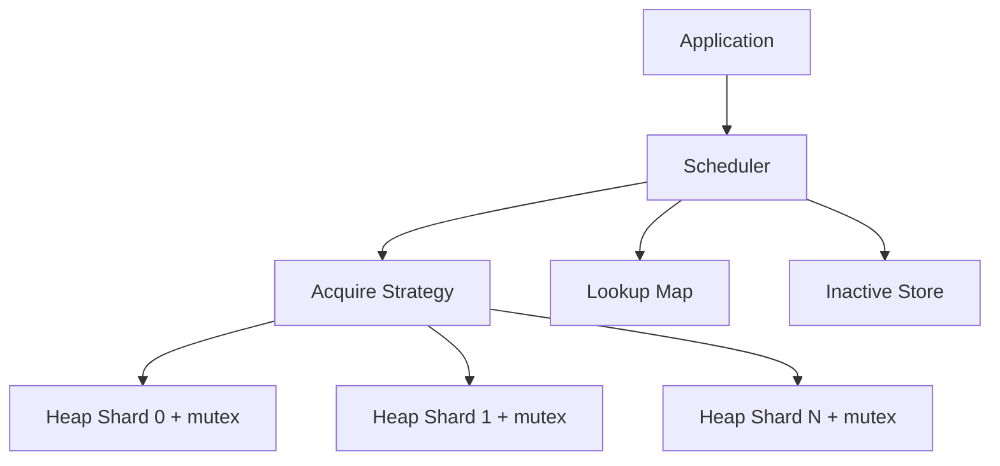
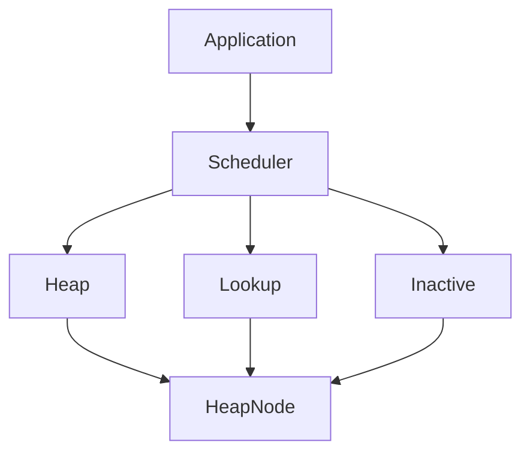
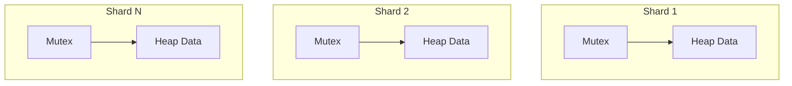
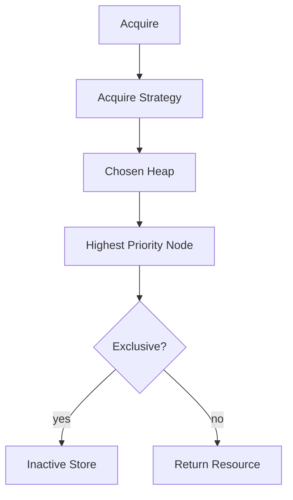
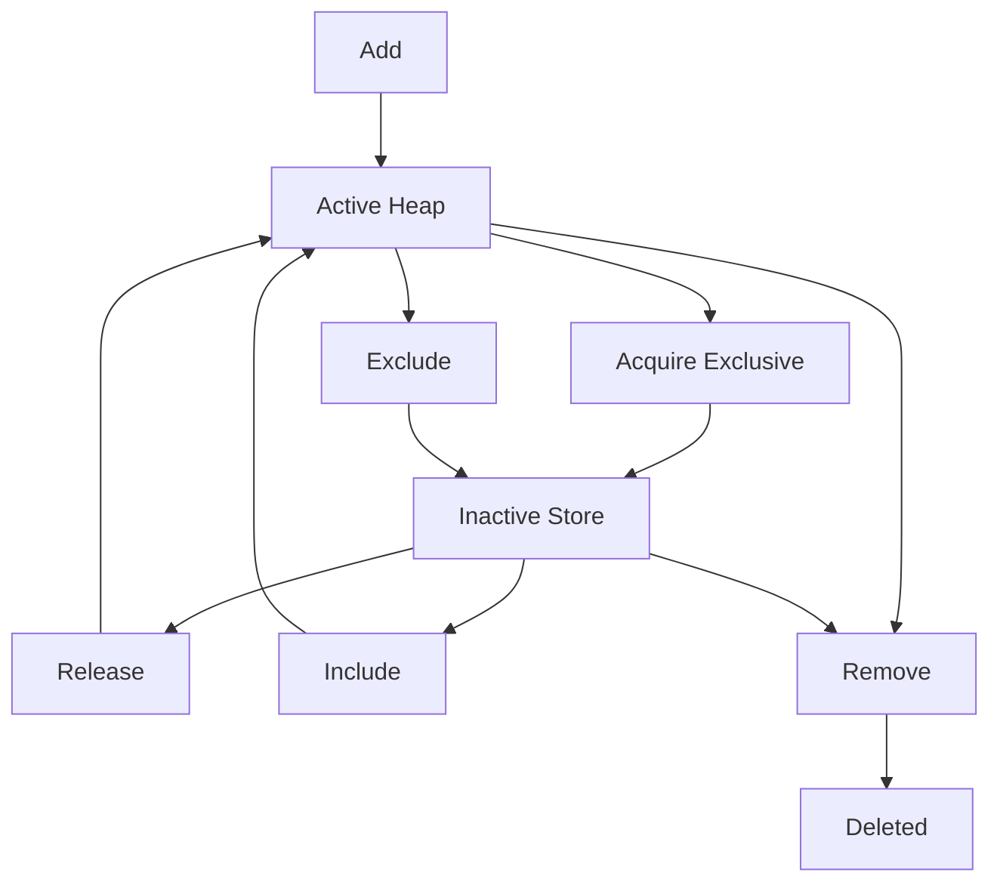

# Concurrent Resource Scheduler (CRS)

CRS is a high-performance, concurrent Go library for selecting and maintaining prioritized reusable resources under heavy load.

It is intentionally domain-agnostic. A resource can represent an API key, proxy, worker, GPU, database replica, service instance, or any other reusable work provider. The embedding application owns the resource type, its business state, and its priority policy. CRS owns safe scheduling and priority-queue maintenance.

---

## Scope

CRS solves one problem: efficiently acquire and maintain prioritized resources while safely supporting concurrent mutation of scheduler state.

It does not implement provider integrations, LLM logic, networking, HTTP APIs, storage, authentication, rate limiting, dashboards, business metrics, or resource health/latency updates.

---

## Design at a glance

### Layered Dependencies
The scheduler is strictly layered. Higher layers depend on lower layers, with no upward dependencies.

- Resources in the **ACTIVE** runtime location are partitioned across independently locked Heap Shards. When resources are added, the scheduler assigns them to shards through an internal Round Robin insertion strategy that is not configurable.
- `HeapCount = 1` provides one global priority heap. `HeapCount > 1` provides intentional sharding; the configured Acquire Strategy is consulted only during `Acquire` to choose which shard to query.
- Round Robin is the default and only built-in Acquire Strategy in v1. Future strategies may include random, least-loaded, consistent-hash, or custom application strategies without scheduler-core changes.
- The application supplies `KeyFunc(T) ID`; CRS never generates or persists resource IDs.
- The Lookup Map maps an application key to its internal `HeapNode`. Heap/shard IDs and heap indexes are runtime-only internal metadata.
- An **Inactive Store** holds resources temporarily removed from scheduling. CRS does not interpret why a resource is inactive.
- `AcquirePolicy` is immutable: `Shared` leaves acquired resources active; `Exclusive` moves them to the Inactive Store until `Release` restores them to their original Heap Shard.
- Responsibilities are independent: Comparator orders resources within a Heap Shard; Acquire Strategy chooses which Heap Shard `Acquire` queries; AcquirePolicy controls Shared versus Exclusive acquire behavior. internal Round Robin insertion strategy (not configurable) assigns newly added resources to shards.
- Scheduler locks protect only scheduler bookkeeping. Application work must remain outside them.
- CRS does not synchronize caller-owned resource fields. Callers must make every comparator-visible field safe to read while the resource is registered.
- Comparators must define a strict weak ordering and be deterministic, thread-safe, pure, fast, non-blocking, and unable to re-enter CRS. Comparator panics propagate; CRS does not recover them.

### Concurrency Model
The scheduler achieves high throughput by strictly sharding heap locks. There is no global heap mutex.

---

## Intended public API

The v1 surface is deliberately small:

| Operation | Purpose |
| --- | --- |
| `New` | Validate configuration and create a scheduler. |
| `BatchAdd` | Atomically validate and insert a batch of resources; validates every element before modifying any state. |
| `Add` | Add one resource. |
| `Remove` | Permanently remove a resource by key: removes from its owning Heap Shard (ACTIVE) or the Inactive Store. Works regardless of `AcquirePolicy`; no Comparator or AcquireStrategy is consulted. |
| `Acquire` | Ask the Acquire Strategy for a shard and return a resource according to `AcquirePolicy`. |
| `Release` | Return an inactive resource (removed by `Exclusive` acquire) to its original Heap Shard. |
| `Get` | Return the resource currently owned by the scheduler by key. Read-only operation. |
| `Len` | Return the total number of resources currently managed by the scheduler (active and inactive). |
| `Exclude` | Remove a resource from its Heap Shard and place it in the Inactive Store. |
| `Include` | Return an inactive resource (removed by `Exclude`) to its original Heap Shard. |
| `Update` | Replace a resource by key (derived by `KeyFunc`): calls `heap.Fix` to restore ordering for ACTIVE resources; replaces the stored value only for INACTIVE resources. Resource identity is immutable. |
| `Stats` | Return a lightweight, read-only snapshot of the scheduler's runtime state. |
| `Shutdown` | End scheduler operation according to its documented lifecycle contract. |

Exact Go signatures and error contracts are established during the roadmap's foundation phase. The package must not grow application-specific API methods.

### Core Flows

#### Acquire Flow
`Acquire` isolates the priority selection from the internal concurrency mechanics.

#### Resource Lifecycle
The lifecycle tracks resources across Active (scheduling) and Inactive (unavailable) states.

---

## Documentation Directory

To maintain a pristine and scalable codebase, this repository heavily relies on structured documentation. Please read these before contributing or utilizing the library:

- 🏗️ **[ARCHITECTURE.md](ARCHITECTURE.md)** — The definitive guide to the system. Covers the detailed design, invariants, internal data structures (HeapNode, Lookup Map), flow charts, locking mechanisms, and complexity targets.
- 🗺️ **[ROADMAP.md](ROADMAP.md)** — The independently buildable and testable execution phases through v1. Shows the exact dependency graph of the subsystems.
- 🤝 **[CONTRIBUTING.md](CONTRIBUTING.md)** — Contribution standards, testing mandates (including race detection), benchmark requirements, and code review expectations.
- 🤖 **[AGENTS.md](AGENTS.md)** — Repository rules specifically designed for automated (AI) and human implementation work. Enforces strict modularity and boundary rules.

---

## Core guarantees and targets

- Per-heap locking; no global mutex serializes normal heap operations.
- No callbacks, I/O, or business-policy work while scheduler locks are held. Comparators are a constrained exception during heap mutation: they must be pure, fast, and non-blocking.
- Heap mutation operations (`Add`, `Update`, `Remove`) target O(log n) work within a heap.
- Lookup operations target expected O(1) work.
- Lookup is O(1); `Add`, `Update`, and `Remove` are O(log n) within a Heap Shard.
- `Acquire` with `Shared` is a heap peek; `Acquire` with `Exclusive` is a heap removal; `Release` is a heap insertion.
- `Shared` intentionally permits concurrent callers to acquire the same resource. `Exclusive` prevents reacquisition until `Release`.

---

## API stability

v1 will avoid breaking public API changes. New functionality should be additive whenever possible; breaking changes are reserved for a future major version.

---

## Status

CRS is currently a documentation and architecture specification. Follow [ROADMAP.md](ROADMAP.md) for the ordered path to a production-ready v1. Do not implement later-phase capabilities before their prerequisites and acceptance criteria are complete.

---

## Guiding principle

> Solve concurrent, prioritized resource selection exceptionally well—and leave application logic to the application.
