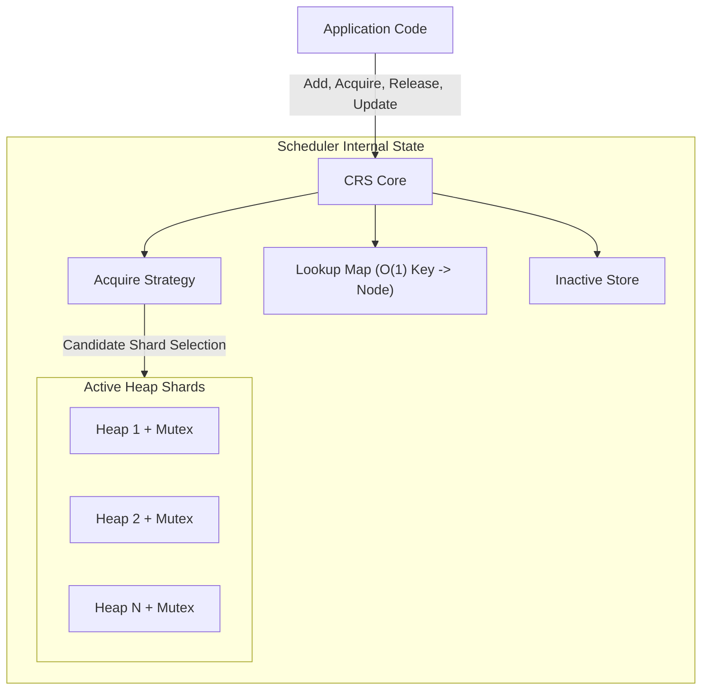
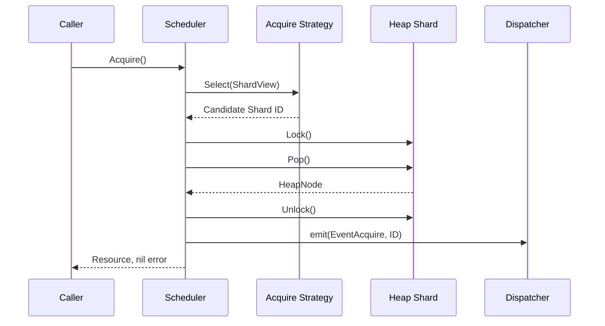
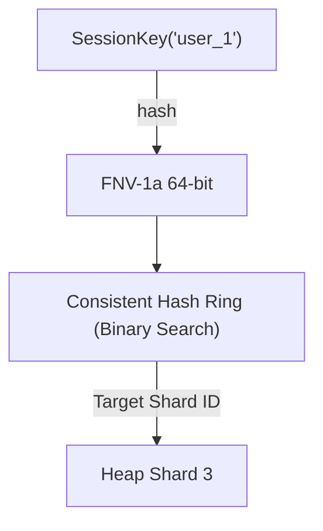
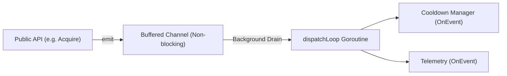

# Concurrent Resource Scheduler

[](https://pkg.go.dev/github.com/phero20/concurrent-resource-scheduler)
[](https://goreportcard.com/report/github.com/phero20/concurrent-resource-scheduler)
[](https://opensource.org/licenses/MIT)
[](https://github.com/phero20/concurrent-resource-scheduler/releases)
[](https://coveralls.io/github/phero20/concurrent-resource-scheduler?branch=main)
[](https://golang.org/doc/go1.25)
[](https://github.com/phero20/concurrent-resource-scheduler/stargazers)
[](https://github.com/phero20/concurrent-resource-scheduler/releases)
[](https://github.com/phero20/concurrent-resource-scheduler/actions)

Concurrent Resource Scheduler (CRS) is a high-performance, domain-agnostic Go library for selecting, prioritizing, and maintaining reusable resources under extreme concurrent load.


---

## Table of Contents
1. [Introduction](#introduction)
2. [Key Features](#key-features)
3. [Architecture](#architecture)
4. [Installation](#installation)
5. [Quick Start](#quick-start)
6. [Core Concepts](#core-concepts)
7. [Usage Guide](#usage-guide)
8. [Thread Safety](#thread-safety)
9. [Extensions](#extensions)
10. [Performance & Benchmarks](#performance--benchmarks)
11. [Testing & Error Handling](#testing--error-handling)
12. [Best Practices](#best-practices)
13. [Examples](#examples)
14. [FAQ](#faq)
15. [Comparison](#comparison)
16. [Developer Guide](#developer-guide)
17. [Project Information](#project-information)

---

## Introduction

In large-scale distributed systems, applications frequently depend on pools of reusable resources. These resources could be proxy servers, database replicas, LLM provider API keys, GPU worker nodes, or network sockets. As throughput scales, managing these pools concurrently becomes a significant bottleneck.

Historically, teams wrap an array with a `sync.Mutex`. As concurrency increases, this naive approach results in severe lock contention, O(N) linear scans, thundering herds, and stale priority state.

CRS abandons global locking and linear scanning. It implements an architecture based on **Sharded Priority Heaps** combined with a **RWMutex-protected O(1) Lookup Map**. By partitioning the resource pool into independently locked sub-heaps, multiple goroutines can simultaneously acquire resources without blocking each other, guaranteeing an O(1) peek rather than an O(N) scan.

### Real-World Use Cases
- **AI/LLM Gateways**: Prioritizing API keys with the highest remaining rate-limit quota.
- **Web Scraping Platforms**: Distributing requests across residential proxies, penalizing timeouts.
- **Database Connection Pooling**: Routing queries to read-replicas with the lowest CPU utilization.
- **Worker Queues**: Assigning jobs to GPU nodes based on available VRAM capacities.

For an extensive high-level perspective, see [`docs/OVERVIEW.md`](./docs/OVERVIEW.md).

---

## Key Features

| Feature | Description |
|---------|-------------|
| **Generic API** | Built heavily upon Go 1.25.5+ Generics (`T any, ID comparable`). The scheduler is completely ignorant of your domain logic. |
| **Concurrent-Safe** | Thread-safe architecture designed for high concurrency and safe for concurrent use from many goroutines. |
| **Lock Architecture** | No global heap mutex exists. Mutations acquire only the necessary shard-local lock. |
| **Multiple Heap Shards** | Configurable via `HeapCount`. Partitions the priority queue to scale concurrent operations across shards. |
| **Acquire Policies** | **Shared**: returns resource, remains active. **Exclusive**: temporarily removes resource until released. |
| **Batch Operations** | Two-phase atomic `BatchAdd` ensures full insertion integrity without exposing partial states. |
| **Affinity Routing** | Deterministic sticky-session routing utilizing an immutable, read-optimized Consistent Hash Ring. |
| **Event System** | Lifecycle transitions (Add, Acquire, Release) are asynchronously broadcasted to observers. |
| **Placement Strategies** | Pluggable interfaces dictating which shard to query first (Round Robin, Weighted, Adaptive). |

---

## Architecture

Understanding the internal architecture is critical for maximizing the scheduler's potential. See [`docs/ARCHITECTURE.md`](./docs/ARCHITECTURE.md) for full details.

### High-Level Component Flowchart



### Acquire (Exclusive) Sequence Diagram



### Consistent Hashing Affinity Routing



---

## Installation

Ensure you are running Go 1.25.5 or higher.

```sh
go get github.com/phero20/concurrent-resource-scheduler
```

```go
import (
    "github.com/phero20/concurrent-resource-scheduler/config"
    "github.com/phero20/concurrent-resource-scheduler/scheduler"
)
```

---

## Quick Start

This example demonstrates the absolute minimum code required to initialize the scheduler, add resources, and perform a shared acquisition.

```go
package main

import (
    "fmt"
    "log"

    "github.com/phero20/concurrent-resource-scheduler/config"
    "github.com/phero20/concurrent-resource-scheduler/scheduler"
)

type Worker struct {
    ID       string
    Priority int
}

func main() {
    // 1. Define priority logic (smaller integer = higher priority)
    compare := func(a, b *Worker) int {
        if a.Priority < b.Priority { return -1 }
        if a.Priority > b.Priority { return 1 }
        return 0
    }

    // 2. Define identity extractor
    keyFunc := func(w *Worker) string { return w.ID }

    // 3. Configure the scheduler
    cfg := config.Config[*Worker, string]{
        HeapCount:  1,
        Comparator: compare,
        KeyFunc:    keyFunc,
    }

    // 4. Create the scheduler
    sched, err := scheduler.New(cfg)
    if err != nil {
        log.Fatal(err)
    }
    defer sched.Shutdown()

    // 5. Add resources
    sched.Add(&Worker{ID: "worker-1", Priority: 50})
    sched.Add(&Worker{ID: "worker-2", Priority: 10}) // Best priority

    // 6. Acquire
    res, _ := sched.Acquire()
    fmt.Printf("Acquired: %s\n", res.ID) // Output: Acquired: worker-2
}
```

---

## Core Concepts

Understanding these concepts is vital to utilizing CRS effectively.

- **Scheduler**: `scheduler.Scheduler[T, ID]` is the core orchestration primitive. It serves as the thread-safe facade wrapping the internal structures.
- **Resources**: Resources (`T`) are completely application-owned. The scheduler has no knowledge of what your resource represents.
- **Heap Nodes**: Internally, the scheduler wraps your resource inside a `HeapNode`, storing its shard ID and status.
- **Lookup Map**: A concurrent `sync.RWMutex` map mapping your `ID` to the internal `*HeapNode` for O(1) retrievals without heap scans.
- **Heap Shards**: Independent, partitioned min-max priority heaps. By setting `HeapCount: 32`, you create 32 independent locks, significantly reducing lock contention under high concurrency.
- **Affinity**: Routing the exact same request key to the exact same shard.

---

## Usage Guide

For complete, detailed API documentation, please see our [`docs/API.md`](./docs/API.md).

### API Walkthrough

- **`New`**: Instantiates the scheduler. Must be called sequentially. O(H) complexity.
- **`Add` / `BatchAdd`**: Registers resources. `BatchAdd` locks shards sequentially and is atomic.
- **`Acquire`**: Queries the `AcquireStrategy` for a candidate shard, then pops/peeks the best resource.
- **`AcquireByAffinity`**: Uses sticky-session routing to consistently query a specific shard.
- **`Release`**: Returns an INACTIVE resource back to its ACTIVE shard. O(1) lookup, single shard lock.
- **`Update`**: Replaces an existing resource's value and triggers an O(log N) heap re-sort.
- **`Exclude` / `Include`**: Manually forces an ACTIVE resource into the Inactive Store and vice-versa.
- **`Remove`**: Permanently deletes a resource.

### Placement Strategies

CRS strictly decouples Priority from Placement.

- **Round Robin (Default)**: Maintains an atomic counter. Distributes traffic evenly irrespective of load.
- **Weighted Strategy**: Accepts capacity weights. Uses an internal splitmix64 avalanche RNG.
- **Adaptive Strategy**: Probabilistically routes traffic to the least congested shard using an atomic, non-blocking `ShardView.ActiveCount()`.
- **Consistent Hash Ring**: Used exclusively by `AcquireByAffinity` for sticky session routing.

### Acquire Policies

The `AcquirePolicy` dictates what happens internally when a resource is returned by `Acquire()`.

- **config.Shared**: The resource remains fully ACTIVE in the shard. Extremely fast `O(1)` heap peeks. Use when your resource is stateless (e.g., DNS resolvers).
- **config.Exclusive**: The resource is popped and moved to the Inactive Store. Requires `O(log N)` operations. Use when your resource represents a rigid capacity limit (e.g., a physical GPU).

---

## Thread Safety

CRS was explicitly built to eliminate the dreaded global mutex contention problem.

### Lock Architecture Model
- **Lookup Map:** Global `sync.RWMutex`.
- **Heap Shard:** `sync.Mutex`. Protects the actual priority queue array.
- **Inactive Store:** `sync.RWMutex`. Protects the isolated map of inactive objects.

### Avoiding Deadlocks
CRS avoids locking multiple heap shards simultaneously, and observer callbacks are dispatched asynchronously after scheduler locks are released, preventing observer re-entry from blocking the scheduler's internal locks.

---

## Extensions

To prevent the core scheduler from becoming bloated with business logic, CRS provides an asynchronous Event System and several built-in extensions.

### 1. The Event System
When an operation completes (e.g., `Add`), the scheduler executes a non-blocking `emit(Event)`. This places the event in a bounded channel. A background goroutine immediately drains this channel and invokes `Observer.OnEvent(e)`. 
CRS operates under a **Strict Drop Policy**: it will silently drop telemetry events rather than block the scheduler's hot path if observers are too slow.



### 2. Cooldown Extension (`extensions/cooldown`)
When using `config.Exclusive`, releasing a resource makes it instantly available. The Cooldown Manager intercepts the `EventRelease`, immediately calls `Exclude(id)`, and schedules a `time.AfterFunc` to call `Include(id)` after a duration expires.

> **Important:** Cooldown is implemented as an asynchronous Observer. Resources become excluded asynchronously after Release(). There exists a very small eventual-consistency window between Release() and Exclude(). This is an intentional tradeoff to preserve the scheduler's non-blocking event architecture. Applications requiring strict synchronous cooldown enforcement should implement cooldown inside scheduler logic instead of using the observer extension.

### 3. Metrics Extension (`extensions/metrics`)
The `TelemetryObserver` provides atomic throughput aggregation. It maintains counters (`AddCount`, `AcquireCount`) via `atomic.AddUint64`. `telemetry.Snapshot()` can be queried thousands of times per second without a single mutex.

### 4. Prometheus Integration (`extensions/prometheus`)
The `Collector` bridges both O(H) structural stats and O(1) telemetry stats into the Prometheus ecosystem, exposing metrics like `crs_heap_count`, `crs_resources_active`, and `crs_events_acquire_total`.

```go
telemetry := metrics.NewTelemetryObserver[string]()
collector := prometheus_ext.NewCollector(sched, telemetry)
prometheus.MustRegister(collector)
```

---

## Performance & Benchmarks

### Time Complexities

| Operation | Best Case | Worst Case | Memory Alloc | Thread Safe |
| :--- | :--- | :--- | :--- | :--- |
| **New / Stats** | O(H) | O(H) | `N` or 0 allocs | Yes |
| **Add / Update / Release** | O(log N) | O(log N) | 1 or 0 allocs | Yes |
| **BatchAdd** | O(B * log N) | O(B * log N)| 0 allocs | Yes |
| **Acquire (Shared)** | O(1) | O(H) | 0 allocs | Yes |
| **Acquire (Exclusive)** | O(log N) | O(H + log N) | 0 allocs | Yes |
| **AcquireByAffinity** | O(log V + log N)| O(log V + log N)| 0 allocs | Yes |

*Legend: H = HeapCount, N = Resources per Shard, B = Batch Size, V = Virtual Hash Nodes (500).*

### Memory & Pathing
- **Memory**: One pointer wrapper (`HeapNode`) per resource. Slices are tightly packed.
- **Hot Paths**: The hot path (`Acquire`) uses 0 memory allocations.
- **Cold Paths**: Operations like `Update` acquire explicit locks but complete in bounded logarithmic time.

### Benchmarks & Performance Characteristics

Heap sharding reduces lock contention under concurrent workloads compared with a single global mutex pool. Actual throughput depends on hardware, workload, resource count, placement strategy, and shard configuration.

To run the built-in placement strategy benchmarks:
```bash
go test -bench=. ./placement
```

---

## Testing & Error Handling

This repository enforces an unyielding testing standard.
- **Unit Tests**: High package-level coverage ranging from 94% to 100% across tested packages.
- **Race Detector**: Validated with Go's race detector (`go test -race ./...`).
- **Stress Tests**: High-concurrency stress tests included across test suites.

### Error Handling

All standard errors are exported from the `errors` package, allowing idiomatic error checking via `errors.Is()`.

| Error | Cause | Recommended Action |
| :--- | :--- | :--- |
| `ErrInvalidHeapCount` | Configured `HeapCount` <= 0 or > 1024. | Correct your `Config` initialization. |
| `ErrDuplicateKey` | Identifier returned by `KeyFunc` already exists. | Use `Update()` instead of `Add()`. |
| `ErrResourceNotFound` | `Release` or `Remove` called on an unknown key. | Check application identity logic. |
| `ErrNotExclusive` | Called `Release()` but `AcquirePolicy` is `Shared`. | Do not use `Release` with `Shared` policies. |
| `ErrNoResourceAvailable` | All shards are completely empty. | Backoff and retry, or provision more resources. |
| `ErrSchedulerClosed` | Attempted operation post-`Shutdown()`. | Check application lifecycle synchronization. |

---

## Best Practices

### Recommended
1. **Size your HeapCount correctly.** Choose `HeapCount` based on your concurrency level, workload, resource distribution, and contention profile. Benchmark representative workloads to find the appropriate value. 
2. **Pre-allocate with BatchAdd.** Use `BatchAdd` at startup instead of a loop of `Add()`. It performs bulk insertion with atomic pre-validation to protect against partial insertion failures.
3. **Use Primitive IDs.** Make your `ID` type a primitive string or integer, not a complex struct, as it is heavily hashed.
4. **Fast Comparators.** Your comparator executes inside the mutex. Keep it extremely fast and do not perform I/O inside it.

### Avoid (Anti-Patterns)
- **DO NOT** use `AcquirePolicy: Shared` and try to modify the returned resource concurrently without your own application locks.
- **DO NOT** block inside an `events.Observer`.
- **DO NOT** ignore errors from `Update()` or `Release()`.

---

## Examples

We provide isolated, production-grade, compilable examples covering all major features. Browse the [`examples/`](./examples) directory.

- **[`basic`](./examples/basic)** - Creating a scheduler and adding simple priority rules.
- **[`batch`](./examples/batch)** - Rapid provisioning using atomic two-phase inserts.
- **[`shared`](./examples/shared)** - High-throughput identical resource leasing.
- **[`exclusive`](./examples/exclusive)** - Strict pop-and-lock capacity protection.
- **[`affinity`](./examples/affinity)** - Deterministic sticky session routing.
- **[`cooldown`](./examples/cooldown)** - Applying the Cooldown Manager observer.
- **[`prometheus`](./examples/prometheus)** - Integrating telemetry and Prom collectors.

---

## FAQ

**1. Can I use CRS without Generics?**
No. CRS requires Go 1.25.5+ and uses Go generics for compile-time type safety without requiring `interface{}`-based resource casting.

**2. What happens if two resources have the same priority?**
The internal heap provides no tie-breaker guarantee. Order will be arbitrary.

**3. Does CRS support weighted placement?**
Yes. Use `placement.NewWeightedStrategy()`.

**4. Can I change the priority of a resource dynamically?**
Yes. Call `Update(res)`. The scheduler will recalculate the heap ordering.

**5. Why did you not use a global Read-Write Mutex?**
Under heavy load, `sync.RWMutex` suffers from cache-line bouncing and starvation. Splitting the state across multiple independent `sync.Mutex` shards scales significantly better.

**6. Is it safe to call Shutdown() multiple times?**
Yes. `Shutdown()` uses `atomic.Bool` to ensure idempotent termination.

**7. Does the telemetry observer cause memory leaks?**
No. It strictly uses fixed atomic counters. It performs no allocations after initialization.

---

## Comparison

### CRS vs Mutex + Slice
| Feature | Mutex + Slice | CRS |
|---------|---------------|-----|
| Scan Complexity | O(N) | O(1) |
| Shard Concurrency | Single Lock | Independent Shards (`HeapCount`) |
| Priority Updates | O(N log N) | O(log N) |
| Deadlock Risk | High (global lock) | Minimized (isolated per-shard locking) |

### CRS vs Go Channels
Go channels are fantastic for FIFO task distribution, but they are intrinsically incapable of dynamic priority resorting. You cannot peek into a channel to find the "best" item, and you cannot update the priority of an item already resting in a channel buffer.

---

## Developer Guide

### Package Layout
- `config/`: Structs for initialization and validation
- `errors/`: Typed sentinels (`ErrNilResource`, etc)
- `events/`: Observer patterns and asynchronous hooks
- `extensions/`: Pluggable non-core architecture (cooldown, metrics)
- `internal/`: Encapsulated state (heap arrays, map lookups)
- `placement/`: AcquireStrategy and Shard selection logic
- `scheduler/`: Core orchestrator and public facade
- `stats/`: Read-only snapshot structures

### Internal Architecture
If you are contributing, familiarize yourself with the internal layers. Lower layers (`heap`) are entirely ignorant of higher layers (`scheduler` or `placement`).
- `internal/heap`: Standard array-backed binary tree. Exposes push, pop, fix, peek.
- `internal/lookup`: `sync.RWMutex` map from `ID` -> `*node.HeapNode`.
- `internal/node`: The struct linking your generic `T` to array indices and active states.

### Extension System
You can build your own extensions by implementing `events.Observer[ID]`. Register it via `config.Observers: []events.Observer[string]{&MyLogger{}}`. Always ensure your `OnEvent` logic never blocks!

---

## Project Information

- 📘 **Documentation & API**: Browse the full library documentation in the [`docs/`](./docs) directory.
- 🛣️ **Roadmap**: View the complete historical architecture phases in [`docs/ROADMAP.md`](./docs/ROADMAP.md).
- 📜 **Changelog**: See [CHANGELOG.md](CHANGELOG.md) for Semantic Versioning history.
- 🤝 **Contributing**: We welcome PRs! Read [CONTRIBUTING.md](CONTRIBUTING.md) for our strict extensive test coverage and Go styling mandates.
- ⚖️ **License**: This project is licensed under the MIT License. See [LICENSE](LICENSE).

### Support
If you encounter issues or have feature requests:
- 🐛 **[GitHub Issues](https://github.com/phero20/concurrent-resource-scheduler/issues)** for bug reports.
- 💬 **[GitHub Discussions](https://github.com/phero20/concurrent-resource-scheduler/discussions)** for architecture help or questions.

### Acknowledgements
Special thanks to the open-source Go community for pioneering robust concurrent programming patterns.

---

> **Concurrent Resource Scheduler** — Built with unwavering production-grade rigor. race-detector validation, and 94–100% package coverage.
