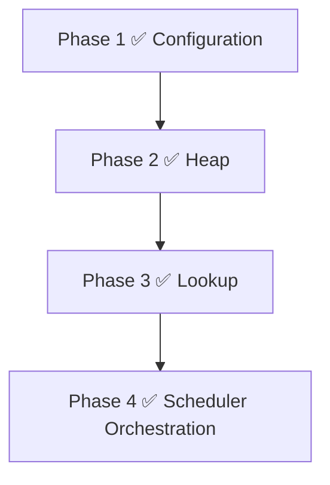

# CRS Roadmap to v1

This roadmap follows the architecture dependency graph, not feature grouping. Each phase implements one core subsystem, is independently buildable and testable, and depends only on prior phases. A phase does not add responsibilities owned by a later subsystem.

## Phase 1 ✅ Contracts and configuration subsystem

### Objectives

- Define the minimal v1 public API, `KeyFunc` application identity, comparator contract, `AcquirePolicy`, configuration model, and typed error taxonomy.

### Deliverables

- Go module and public/package documentation.
- `config` validation for `HeapCount`, `Comparator`, `KeyFunc`, and `AcquirePolicy`, following the constructor lifecycle: defaults are resolved first, then the resolved configuration is validated.
  - `HeapCount = 0` defaults to `1`; `AcquireStrategy = nil` defaults to Round Robin; zero `AcquirePolicy` defaults to `Shared`.
  - An internal maximum heap count constant guards against accidental resource exhaustion. Exceeding it returns `ErrInvalidConfig`; the scheduler never silently clamps the caller's value.
- `errors` definitions and documented nil, ownership, and invalid-input behavior.
- Deterministic contract tests.

### Acceptance criteria

- `go test ./...` passes.
- Invalid configuration and public contract boundaries have focused tests.
- Comparator constraints include strict weak ordering, purity, bounded and non-blocking execution, thread safety, no scheduler re-entry, panic propagation, and race-safe caller-owned priority state.
- Contract documentation distinguishes independent Comparator, Acquire Strategy, and AcquirePolicy responsibilities. Acquire Strategy is documented as Acquire-only; internal Round Robin insertion strategy governs shard assignment for `Add` and `BatchAdd`.
- No heap, lookup, selector, lifecycle, or scheduling coordination implementation exists.

## Phase 2 ✅ Indexed heap subsystem

### Objectives

- Implement the private priority heap that maintains comparator order and a heap-local index.

### Deliverables

- `heap` package with push, peek, fix, remove, and index-maintenance behavior.
- Unit tests for ordering, swaps, insertion, removal, fix, and invariant preservation.

### Acceptance criteria

- Every heap mutation preserves the comparator-defined heap property and index correctness.
- Push, fix, and remove are O(log n); peek is O(1).
- The package has no lookup map, round robin, scheduler facade, lifecycle, or domain policy.
- `go test ./...` passes.

## Phase 3 ✅ Lookup subsystem

### Objectives

- Implement KeyFunc-derived application-key to HeapNode membership and the architecture-defined Lookup Map synchronization protocol.

### Deliverables

- `lookup` package with application-key to `*HeapNode` membership operations.
- Tests for duplicate-key prevention, unknown-key behavior, concurrent readers/writers, and HeapNode runtime-location lifecycle.

### Acceptance criteria

- Map membership operations have expected O(1) behavior.
- The package never owns application identity generation, heap ordering, or exposed runtime metadata.
- Its API supports the documented add/update/remove coordination protocol without exposing internals to callers.
- `go test ./...` and `go test -race ./...` pass.

## Phase 4 ✅ Scheduler orchestration

### Objectives

- Compose the completed heap, lookup, and placement packages into concurrent core scheduling operations.
- Implement the generic Acquire Strategy abstraction and the default thread-safe Round Robin strategy for `Acquire`-shard selection.
- Add lifecycle operations and immutable scheduler statistics.
- Establish the repeatable verification assets required to declare the composed v1 scheduler production-ready.

### Deliverables

- Runtime initialization
- Add
- BatchAdd
- Acquire
- Release
- Update
- Remove
- Include
- Exclude
- Get
- Len
- Stats
- Shutdown
- Stress tests
- Race-test validation

### Acceptance criteria

- Normal operations hold no more than one heap mutex and never use a global heap lock.
- `Acquire` uses one global heap when `HeapCount = 1`; with multiple Heap Shards it asks AcquireStrategy for the next candidate shard, locks only that shard, and checks whether it is non-empty. If empty, it unlocks and asks AcquireStrategy for the next candidate, repeating until a non-empty shard is found or every shard has been inspected. When all shards are empty, `Acquire` returns `ErrNoResourceAvailable`.
- `Acquire` locks only the single selected shard per iteration; multiple concurrent `Acquire` calls may operate on different shards simultaneously.
- `Acquire` never modifies resource priority, never rebalances heaps, and never recalculates comparator ordering.
- `Add` and `BatchAdd` assign resources to shards through the internal Round Robin insertion strategy, not through AcquireStrategy. `Shared` leaves a resource active; `Exclusive` moves it to the Inactive Store until `Release`. `Exclude` moves an ACTIVE resource to the Inactive Store until `Include`.
- `Update` never consults AcquireStrategy and never moves a resource between heaps. It locks only the owning shard (ACTIVE path) or the Inactive Store (INACTIVE path); it never holds multiple shard locks.
- `Remove` permanently unregisters a resource from either runtime location and removes its Lookup Map entry.
- `BatchAdd` validates the entire batch before modifying any scheduler state. Phase 2 (insertion) begins only when Phase 1 (validation) passes entirely.
- Statistics collection does not expose internal structures, lists of resources, or mutate scheduler internals. It executes in O(H) where H is the number of heap shards.
- Full tests and race detector pass consistently.
- Stress workloads show no deadlocks, invariant failures, or bookkeeping corruption.

## Phase 5 — Advanced Placement Strategies

Expand the `AcquireStrategy` ecosystem beyond Round Robin to support advanced distributed systems patterns without altering the core scheduler concurrency model.

### Phase 5.1 — Sticky Selection (Affinity Routing)

#### 1. Goal
Implement a mechanism that consistently routes requests with the same session affinity key to the same Heap Shard, without polluting the core scheduler with request contexts.

#### 2. Responsibilities
- Introduce a dedicated, explicit public method `AcquireByAffinity(key placement.AffinityIdentifier)`.
- Use `placement.AffinityIdentifier` which provides an `AppendAffinityBytes(dst []byte) []byte` contract.
- Use a deterministic internal hash function (FNV-1a) to map the bytes directly to a shard index `[0, HeapCount)`.
- Bypass the general `AcquireStrategy` abstraction completely for this method.
- Make it explicit that the scheduler remains type-agnostic (any custom application struct can implement the interface). The scheduler provides a small stack buffer to avoid allocations where possible.

#### 3. Files/packages involved
- `scheduler/acquire.go`
- `scheduler/acquire_test.go`

#### 4. Architectural boundaries
- **Architectural Correction:** `context.Context`, `any`, and `string` are rejected. The scheduler is a generic primitive and must remain independent of request contexts, HTTP, or RPC concepts. Using `context.Value` or `fmt.Sprintf` on `any` is an anti-pattern that causes allocations.
- The `Acquire()` method and `AcquireStrategy` interface remain completely untouched (zero arguments). 
- `AcquireByAffinity(key)` clearly signals targeted routing intent, keeping the general placement ecosystem (`Acquire()`) clean and fully backward compatible (no changes to the `Scheduler[T, ID]` signature).
- The scheduler does not expose internal shard indices to the caller.
- The scheduler completely owns hashing and shard selection.

#### 5. Concurrency considerations
- The internal hashing of the affinity identifier must be lock-free and thread-safe.
- Reuses the existing single-shard locking and `Shared`/`Exclusive` logic inside the new affinity API.

#### 6. Required unit tests
- Verify that the same affinity key deterministically selects the same shard.
- Verify that the new API correctly respects `Shared` and `Exclusive` policies.

#### 7. Required race tests
- Highly concurrent affinity-based acquire calls across many goroutines.

#### 8. Required benchmarks
- Measure the overhead of the internal identifier hashing compared to the standard `Acquire()` strategy lookup.

#### 9. Freeze criteria
- Architecture strictly preserves the generic nature of `Acquire()` and the existing `AcquireStrategy` ecosystem remains unaware of sticky selection.
### Phase 5.2 ✅ Consistent Hashing Affinity Enhancement

#### 1. Goal
Provide mathematically deterministic resource selection based on consistent hashing to maximize cache hit rates for specific workloads, replacing the naive modulo hashing of Phase 5.1.

#### 2. Architecture Rationale
True consistent hashing requires a stable routing key (e.g. user ID). Because the standard `AcquireStrategy` interface `Select(view ShardView) int` lacks a routing key, consistent hashing cannot be implemented as a generic `AcquireStrategy`. Attempting to do so by hashing a counter merely creates probabilistic load balancing with no advantage over Round Robin. Therefore, Consistent Hashing is implemented strictly as an internal enhancement to the `AcquireByAffinity` routing path.

#### 3. Execution
- Implement an internal lock-free `ConsistentHashRing` mapping in the `placement` package.
- Incorporate this ring securely into the `Scheduler` initialization.
- Upgrade `AcquireByAffinity` to route `AffinityIdentifier` hashes through the ring instead of `% HeapCount`.

#### 4. Freeze criteria
- Architecture strictly preserves the generic nature of `Acquire()` and the existing `AcquireStrategy` ecosystem.
- `ConsistentHashRing` remains an internal data structure, not an `AcquireStrategy`.

### Phase 5.3 ✅ Weighted Selection Strategy

#### 1. Goal
Allow shards to receive traffic proportional to an assigned weight capacity.

#### 2. Responsibilities
- Implement a thread-safe weighted random or weighted round-robin selection algorithm.
- Accept static weight configurations per shard at initialization.

#### 3. Files/packages involved
- `placement/weighted.go`
- `placement/weighted_test.go`

#### 4. Architectural boundaries
- Selection logic operates purely on initialization weights.
- Never inspects individual resources to calculate weights.

#### 5. Concurrency considerations
- Random Number Generators (RNG) used for selection must be safe for concurrent use or use atomic counters for weighted round-robin.

#### 6. Required unit tests
- Statistical distribution tests over millions of iterations to verify weight compliance.

#### 7. Required race tests
- High concurrency testing of the RNG or atomic state variables.

#### 8. Required benchmarks
- Impact of RNG contention or atomic increments at scale.

#### 9. Freeze criteria
- Contention on the strategy's internal state does not degrade overall `Acquire` throughput.

### Phase 5.4 ✅ Adaptive Load Balancing Strategy

#### 1. Goal
Dynamically favor less-contended Heap Shards based on lightweight load metrics without introducing global locking.

#### 2. Responsibilities
- Implement a strategy that uses the existing `ShardView` abstraction to determine which shards are least loaded.
- Select the next candidate shard probabilistically based on inverse load.

#### 3. Files/packages involved
- `placement/adaptive.go`
- `placement/adaptive_test.go`

#### 4. Architectural boundaries
- **Architectural Correction:** `Stats()` is an O(H) operation that aggregates data across all heaps and does not belong on the O(log n) `Acquire` hot path.
- The correct boundary for lightweight load information is the `ShardView.ActiveCount(shard)` method, which is already passed to the strategy and provides O(1) shard-local state without cross-heap locking.
- Must strictly use `ShardView` or strategy-local atomic counters.

#### 5. Concurrency considerations
- Must not introduce a global scheduler lock.
- Read operations for load metadata must be entirely lock-free or strictly scoped to the `ShardView` during the `Acquire` hot path.

#### 6. Required unit tests
- Verify traffic shifts away from heavily loaded shards towards lightly loaded shards.

#### 7. Required race tests
- Concurrent `Acquire` calls verifying that `ActiveCount` reads do not cause lock inversion or contention.

#### 8. Required benchmarks
- Measure the impact of load-calculation overhead on `Acquire` latency.

#### 9. Freeze criteria
- Architecture strictly preserves the O(log n) acquire path and independent heap locking guarantees.

## Phase 6 — Scheduler Hooks & Extension APIs

**Goal**: Transform the scheduler into an extensible event-driven library without embedding business logic. The scheduler remains generic while allowing external packages to react to internal lifecycle events.

### Phase 6.1 ✅ Event Taxonomy & Observer Contract

#### 1. Goal
Establish the foundational API contract for external components to observe scheduler lifecycle events without executing business logic inside the scheduler.

#### 2. New Public APIs
- `EventType` (Enum: `EventAdd`, `EventAcquire`, `EventRelease`, `EventExclude`, `EventInclude`, `EventRemove`, `EventUpdate`).
- `Event[ID any]` struct containing the `EventType` and the resource `ID` (passing `ID` instead of the full resource prevents concurrent mutation races, and omitting a Timestamp avoids `time.Now()` hot-path overhead).
- `Observer[ID any]` interface defining `OnEvent(e Event[ID])`.
- Update `config.Config` to accept an optional `Observers []Observer[ID]` slice.

#### 3. Internal Architectural Changes
None yet. This phase purely establishes the types and configuration validation.

#### 4. Freeze criteria
The `Event` and `Observer` API contract is fully defined, reviewed, and merged without altering any existing runtime behavior.

### Phase 6.2 ✅ Asynchronous Non-Blocking Dispatcher

#### 1. Goal
Implement a high-performance internal dispatch mechanism that routes events to observers without ever blocking the scheduler's hot path or holding scheduler locks.

#### 2. Internal Architectural Changes
- Introduce a bounded, lock-free ring buffer or buffered channel (`eventStream`) inside the `Scheduler`.
- Introduce a dedicated background goroutine (`dispatchLoop`) started during `New()` that drains the `eventStream` and executes `Observer.OnEvent()`.
- **Strict Drop Policy**: `emit()` performs a non-blocking send. If the buffer is full, the event is dropped immediately and silently, and scheduler execution continues without blocking.

#### 3. Freeze criteria
The internal dispatcher achieves 100% branch coverage for buffer overflows, slow observers, and correct shutdown of the background goroutine.

### Phase 6.3 ✅ Core Lifecycle Instrumentation

#### 1. Goal
Wire the internal event dispatcher into the scheduler's actual runtime operations to broadcast accurate state transitions.

#### 2. Internal Architectural Changes
- Instrument `Acquire()`, `Release()`, `Exclude()`, `Include()`, `Add()`, `Update()`, and `Remove()`.
- Insert the non-blocking `emit(Event)` call into these methods.

#### 3. Concurrency considerations
- **CRITICAL**: `emit(Event)` must be called **strictly after** the internal `heap.Unlock()` or `lookup.RUnlock()` calls have executed to prevent lock inversions.

#### 4. Freeze criteria
Every scheduler public method successfully broadcasts its corresponding event to all registered observers precisely *after* committing its state changes.

### Phase 6.4 ✅ Reference Integration (External Cooldown Manager)

#### 1. Goal
Validate the architecture by building a realistic, advanced feature entirely *outside* of the scheduler core, utilizing only the public API and the new Observer hooks.

#### 2. New Public APIs
- A new sub-package: `extensions/cooldown`.
- `NewManager(scheduler, cooldownDuration)` which implements `Observer[ID]`.

#### 3. Internal Architectural Changes
- **None.** The scheduler remains entirely ignorant of what a "cooldown" is.

#### 4. Freeze criteria
The `extensions/cooldown` package works flawlessly, proving that developers have all the tools they need to build advanced components without polluting the scheduler.

## Phase 7 — Observability & Metrics

**Goal**: Expose the scheduler's internal state to industry-standard monitoring systems to provide operators with real-time visibility into capacity and contention, without introducing hot-path overhead or core dependencies.

### Phase 7.1 ✅ Telemetry & Metrics Aggregation

#### 1. Goal
Capture and aggregate real-time scheduler state transitions (e.g., acquire throughput, release rates, churn) entirely outside the core scheduler by leveraging the Phase 6 Event system.

#### 2. Public APIs
- New package: `extensions/metrics`
- `type TelemetryObserver struct` (implements `events.Observer[ID]`)
- `func NewTelemetryObserver[ID comparable]() *TelemetryObserver`
- `func (o *TelemetryObserver) Snapshot() TelemetryStats`
- `type TelemetryStats struct` (containing throughput counters for Acquired, Released, Added, Excluded, etc.)

#### 3. Internal Architectural Changes
- **None.** The core scheduler remains untouched. This utilizes the existing observer hooks.

#### 4. Concurrency considerations
- The `TelemetryObserver` must use `sync/atomic` counters exclusively to aggregate event totals.
- It must **never** block or use mutexes in its `OnEvent` implementation, ensuring the scheduler's background dispatcher remains blazing fast.

#### 5. Testing requirements
- Validate that `TelemetryObserver` accurately increments the correct atomic counters for every `EventType`.
- Run race detector tests to ensure `Snapshot()` can be safely called concurrently while the dispatcher is actively pumping events into the observer.

#### 6. Freeze criteria
The `TelemetryObserver` provides a 100% thread-safe, lock-free aggregation of operational throughput without any core scheduler modifications.

### Phase 7.2 ✅ Metrics Exporters

#### 1. Goal
Provide a production-ready reference integration bridging both the point-in-time O(H) `scheduler.Stats()` and the real-time `TelemetryStats` into ecosystems like Prometheus, without introducing third-party dependencies to the core library.

#### 2. Public APIs
- New packages: e.g., `extensions/prometheus` (explicitly isolates the dependency from the rest of the library).
- `func NewCollector[T any, ID comparable](sched *scheduler.Scheduler[T, ID], telemetry *metrics.TelemetryObserver) prometheus.Collector`

#### 3. Internal Architectural Changes
- **None.**

#### 4. Concurrency considerations
- Prometheus scrapes occur concurrently and asynchronously.
- The collector must safely call the thread-safe `sched.Stats()` (which takes short-lived O(1) locks per shard) and `telemetry.Snapshot()` (atomic reads) without deadlocking or starving the hot path.

#### 5. Testing requirements
- Unit test using `prometheus/client_golang/prometheus/testutil` to verify all exported metrics are formatted accurately.
- Validate that the collector successfully ignores nil telemetry observers if the application chooses not to track throughput.

#### 6. Freeze criteria
The exporter cleanly bridges CRS data to Prometheus. Once merged, Phase 7 is fully complete and the Concurrent Resource Scheduler is unequivocally ready for a `v1.0.0` stable release.
