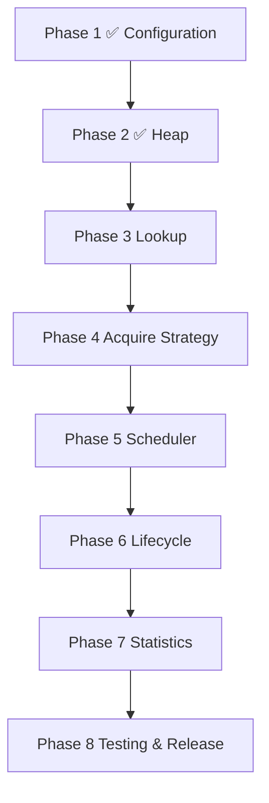

# CRS Roadmap to v1

This roadmap follows the architecture dependency graph, not feature grouping. Each phase implements one core subsystem, is independently buildable and testable, and depends only on prior phases. A phase does not add responsibilities owned by a later subsystem.

## Phase 1 — Contracts and configuration subsystem

### Objectives

- Define the minimal v1 public API, `KeyFunc` application identity, comparator contract, `AcquirePolicy`, configuration model, and typed error taxonomy.

### Deliverables

- Go module and public/package documentation.
- `config` validation for `HeapCount`, `Comparator`, `KeyFunc`, and `AcquirePolicy`, following the constructor lifecycle: defaults are resolved first, then the resolved configuration is validated.
  - `HeapCount = 0` defaults to `1`; `AcquireStrategy = nil` defaults to Round Robin; zero `AcquirePolicy` defaults to `Shared`.
  - An internal maximum heap count constant guards against accidental resource exhaustion. Exceeding it returns `ErrInvalidConfig`; the scheduler never silently clamps the caller's value.
- `errors` definitions and documented nil, ownership, and invalid-input behavior.
- Deterministic contract tests.

### Acceptance criteria

- `go test ./...` passes.
- Invalid configuration and public contract boundaries have focused tests.
- Comparator constraints include strict weak ordering, purity, bounded and non-blocking execution, thread safety, no scheduler re-entry, panic propagation, and race-safe caller-owned priority state.
- Contract documentation distinguishes independent Comparator, Acquire Strategy, and AcquirePolicy responsibilities. Acquire Strategy is documented as Acquire-only; internal balanced distribution governs shard assignment for `Add` and `BatchAdd`.
- No heap, lookup, selector, lifecycle, or scheduling coordination implementation exists.

## Phase 2 — Indexed heap subsystem

### Objectives

- Implement the private priority heap that maintains comparator order and a heap-local index.

### Deliverables

- `heap` package with push, peek, fix, remove, and index-maintenance behavior.
- Unit tests for ordering, swaps, insertion, removal, fix, and invariant preservation.

### Acceptance criteria

- Every heap mutation preserves the comparator-defined heap property and index correctness.
- Push, fix, and remove are O(log n); peek is O(1).
- The package has no lookup map, round robin, scheduler facade, lifecycle, or domain policy.
- `go test ./...` passes.

## Phase 3 — Lookup subsystem

### Objectives

- Implement KeyFunc-derived application-key to HeapNode membership and the architecture-defined Lookup Map synchronization protocol.

### Deliverables

- `lookup` package with application-key to `*HeapNode` membership operations.
- Tests for duplicate-key prevention, unknown-key behavior, concurrent readers/writers, and HeapNode runtime-location lifecycle.

### Acceptance criteria

- Map membership operations have expected O(1) behavior.
- The package never owns application identity generation, heap ordering, or exposed runtime metadata.
- Its API supports the documented add/update/remove coordination protocol without exposing internals to callers.
- `go test ./...` and `go test -race ./...` pass.

## Phase 4 — Acquire Strategy subsystem

### Objectives

- Implement the generic Acquire Strategy abstraction and the default thread-safe Round Robin strategy for `Acquire`-shard selection.

### Deliverables

- `placement` package with the strategy contract, read-only placement view, and overflow-safe private Round Robin implementation.
- Deterministic sequential and concurrent Round Robin distribution tests.

### Acceptance criteria

- Every strategy result is validated in `[0, heapCount)`.
- Round Robin cycles fairly; custom strategies receive no HeapNode, lock, or mutable Heap Shard access.
- The package has no priority comparator, heap mutation, Lookup Map, or scheduler lifecycle logic.
- `go test ./...` and `go test -race ./...` pass.

## Phase 5 — Scheduler coordination subsystem

### Objectives

- Compose the completed heap, lookup, and placement packages into concurrent core scheduling operations.

### Deliverables

- `scheduler` implementation of `Add`, `BatchAdd`, `Acquire`, `Release`, `Exclude`, `Include`, `Update`, `Remove`, `Get`, and `Len`.
- One mutex per Heap Shard, an Inactive Store, and the documented Lookup Map/HeapNode lock protocol.
- Cross-package tests for placement, global priority with one heap, shard-local priority with multiple Heap Shards, shared/exclusive acquire, release, lookup consistency, and concurrent add/update/remove.

### Acceptance criteria

- Normal operations hold no more than one heap mutex and never use a global heap lock.
- `Acquire` uses one global heap when `HeapCount = 1`; with multiple Heap Shards it asks AcquireStrategy for the next candidate shard, locks only that shard, and checks whether it is non-empty. If empty, it unlocks and asks AcquireStrategy for the next candidate, repeating until a non-empty shard is found or every shard has been inspected. When all shards are empty, `Acquire` returns `ErrNoResourceAvailable`.
- `Acquire` locks only the single selected shard per iteration; multiple concurrent `Acquire` calls may operate on different shards simultaneously.
- `Acquire` never modifies resource priority, never rebalances heaps, and never recalculates comparator ordering. It trusts existing heap order; the application must call `Update` to restore order when priority state changes.
- AcquireStrategy selects the next candidate shard only; it does not determine whether a shard is usable. The scheduler makes that determination after locking.
- `Add` and `BatchAdd` assign resources to shards through the internal balanced distribution, not through AcquireStrategy. `Shared` leaves a resource active; `Exclusive` moves it to the Inactive Store until `Release`. `Exclude` moves an ACTIVE resource to the Inactive Store until `Include`.
- `Update` accepts the replacement resource; the scheduler derives the key by calling `KeyFunc(resource)`. Resource identity is immutable: `Update` never changes the key of a registered resource. A nil resource returns `ErrNilResource`; an unregistered key returns `ErrNotFound`.
- For ACTIVE resources, `Update` replaces the stored value and calls `heap.Fix()` to restore comparator-defined ordering without remove/reinsert and without creating a new HeapNode. For INACTIVE resources (in the Inactive Store), `Update` replaces the stored value only; no heap operation is performed and no shard is locked. The updated value is reinserted with correct ordering when `Release` or `Include` is called.
- `Update` never consults AcquireStrategy and never moves a resource between heaps. It locks only the owning shard (ACTIVE path) or the Inactive Store (INACTIVE path); it never holds multiple shard locks.
- Failed `Update` leaves the original resource value, heap ordering, and Inactive Store state unchanged.
- `Remove` accepts only the application key; no resource object is accepted. It permanently unregisters a resource from either runtime location and removes its Lookup Map entry.
- For ACTIVE resources, `Remove` locks only the owning Heap Shard and removes the HeapNode by its stored index; no Comparator is called. For INACTIVE resources (in the Inactive Store), `Remove` uses only the Inactive Store's synchronization; no shard is locked and no Comparator is called.
- `Remove` behaves identically regardless of `AcquirePolicy`. It never consults AcquireStrategy and never locks every shard simultaneously.
- Failed `Remove` leaves heap membership, Inactive Store membership, and the Lookup Map entry all consistent and unchanged.
- Failed mutations leave heap membership, heap index, and lookup invariants true.
- `go test ./...` and `go test -race ./...` pass.

## Phase 6 — Lifecycle subsystem

### Objectives

- Add lifecycle operations without introducing resource business policy.

### Deliverables

- Initialization-only `BatchAdd` with atomic validation-and-publication semantics.
- `Shutdown` with an explicit, concurrent-safe lifecycle contract.
- Lifecycle-focused integration tests.

### Acceptance criteria

- `BatchAdd` is accepted only before normal scheduler operation; a failed batch publishes no member of its batch.
- `BatchAdd` validates the entire batch before modifying any scheduler state: nil elements return `ErrNilResource`, intra-batch duplicate keys return `ErrDuplicateKey`, and keys already registered in the scheduler return `ErrDuplicateKey`. Phase 2 (insertion) begins only when Phase 1 (validation) passes entirely.
- `BatchAdd` uses the same per-element identity contract as `Add`: the scheduler calls `KeyFunc(resource)` to derive each key; no separate ID parameter is accepted.
- `BatchAdd` uses the internal balanced distribution for shard assignment; AcquireStrategy is not involved.
- `BatchAdd` is not documented or implemented as a loop over `Add`; it may apply bulk heap-building optimizations while providing the same observable behavior and error guarantees.
- `KeyFunc` or `Comparator` panics propagate to the caller; CRS does not recover them.
- Shutdown has one documented outcome for in-flight and later operations, with no deadlock or partial scheduler mutation.
- `go test ./...` and `go test -race ./...` pass.

## Phase 7 — Statistics subsystem

### Objectives

- Provide low-overhead, immutable scheduler statistics without adding metrics-exporter behavior.

### Deliverables

- `Stats()` implementation returning an O(H) snapshot (`HeapCount`, `TotalResources`, `ActiveResources`, `InactiveResources`, `EmptyHeaps`, `NonEmptyHeaps`, `AcquireStrategy`, `AcquirePolicy`, and `HeapSizes`).
- Tests for counter correctness, snapshot consistency, and concurrent reads.

### Acceptance criteria

- Statistics collection does not expose internal structures, lists of resources, or mutate scheduler internals. It executes in O(H) where H is the number of heap shards.
- Returned statistics cannot mutate scheduler internals.
- `go test ./...` and `go test -race ./...` pass.

## Phase 8 — Verification subsystem and v1 release gate

### Objectives

- Establish the repeatable verification assets required to declare the composed v1 scheduler production-ready.

### Deliverables

- Black-box integration suite, mixed-operation stress suite, race-test workflow, and benchmark suite.
- Benchmarks for shared/exclusive acquire, release, update, remove, heap counts, resource-pool sizes, allocation behavior, and contention.
- Performance baseline, API/documentation audit, and release checklist.

### Acceptance criteria

- Full tests and race detector pass consistently.
- Stress workloads show no deadlocks, invariant failures, or bookkeeping corruption.
- Benchmark results are reproducible and reviewed for hot-path regressions.
- README, architecture, roadmap, contribution guide, and agent rules agree on public contracts, phases, complexity, and locking.
- No deferred extension is included in v1.

## Deferred after v1

Weighted selection, adaptive load balancing, cooldowns, sticky selection, consistent hashing, health-aware adapters, metrics exporters, and pluggable policies remain deferred. Each requires a separate architecture, compatibility, race, and benchmark review after the core scheduler is stable.
