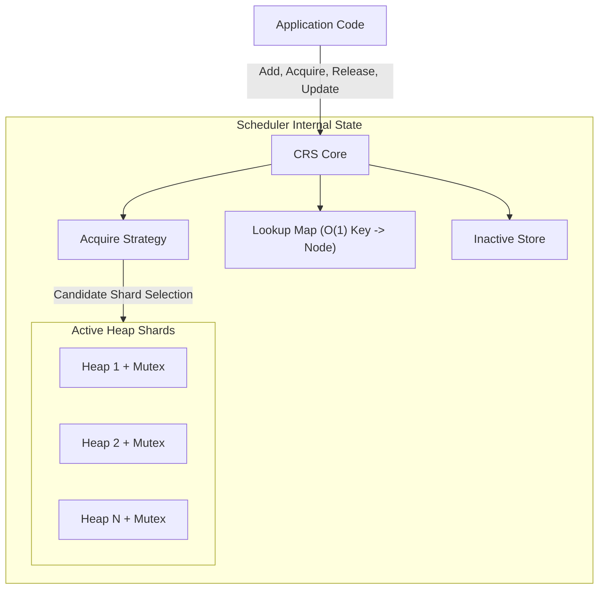

# Concurrent Resource Scheduler (CRS) - Executive Overview

This document provides a concise, high-level summary of the CRS architecture, its core operational flows, the strict implementation rules governing its development, and its performance characteristics.

## 1. Architectural Overview

CRS is a domain-agnostic, high-performance Go library for scheduling prioritized, reusable resources concurrently. It delegates business logic (priority scoring, resource health) to the application and focuses solely on **thread-safe priority queue maintenance, sharding, and telemetry**.

### Core Components:
- **Heap Shards:** Resources are distributed across multiple independently locked heaps, eliminating the global lock bottleneck.
- **Lookup Map:** An O(1) concurrent map linking an application-provided key (derived via `KeyFunc`) to an internal `HeapNode`.
- **Inactive Store:** A holding pool for resources temporarily removed from scheduling (e.g., exclusively acquired or manually excluded).
- **Acquire Strategy:** An abstraction (RoundRobin, Adaptive, Weighted) consulted **only** during `Acquire` to determine which Heap Shard to query next.
- **Telemetry Dispatcher:** An asynchronous, non-blocking bounded event channel broadcasting internal state transitions to external `Observer` extensions (like Prometheus or Cooldown Managers).

---

## 2. Core Flows

- **Add / BatchAdd:** The resource is validated, assigned an application key, checked for duplication, and internally distributed to a target Heap Shard via Round-Robin load balancing.
- **Acquire:** The scheduler asks the Acquire Strategy for a candidate shard, locks that shard, and checks for available resources. 
  - `Shared` policy: The resource stays in the heap.
  - `Exclusive` policy: The resource is atomically removed from the heap and placed in the **Inactive Store**.
- **AcquireByAffinity:** Bypasses Acquire Strategy entirely, hashing an `AffinityIdentifier` through a virtualized `ConsistentHashRing` to deterministically target a specific shard.
- **Release:** Looks up the resource in the Inactive Store, retrieves its original Shard ID, locks that specific shard, and reinserts it.
- **Exclude / Include:** `Exclude` manually moves a resource to the Inactive Store (e.g., for maintenance). `Include` restores it to its original shard.
- **Update:** If ACTIVE, updates the resource value and calls `heap.Fix()` to restore priority ordering under the shard lock. If INACTIVE, simply updates the stored value in the Inactive Store.
- **Get / Len / Stats:** Read-only O(1) or O(H) operations that safely snapshot scheduler state without mutating it.

---

## 3. Placement Strategies & Policies

CRS includes a rich ecosystem of placement methodologies:

### Acquire Policies (Global Behavior)
- **Shared:** Multiple concurrent callers can acquire the exact same resource. The resource remains active in the heap.
- **Exclusive:** Once acquired, the resource is hidden in the Inactive Store. No other caller can acquire it until it is `Release()`'d.

### Acquire Strategies (Routing Behavior)
- **RoundRobin:** Uniformly iterates through shards (default).
- **Weighted:** Distributes traffic proportionally across shards based on static initialization weights via a thread-safe splitmix64 avalanche RNG.
- **Adaptive:** Dynamically favors less-contended Heap Shards based on lightweight O(1) load metrics without introducing global locks.
- **ConsistentHashRing:** (Invoked via `AcquireByAffinity`) Uses a 500-vnode deterministic hash ring to map sticky sessions to stable shards.

---

## 4. Extension System

The scheduler acts as a zero-dependency kernel. It exposes a non-blocking `events.Observer` contract. Extensions listen for state transitions (e.g., `EventAcquire`, `EventRelease`) and react asynchronously:

- **Cooldown Manager** (`extensions/cooldown`): Temporarily moves a released resource to the Inactive Store for a timeout before re-including it.

  > **Important:** Cooldown is implemented as an asynchronous Observer. Resources become excluded asynchronously after Release(). There exists a very small eventual-consistency window between Release() and Exclude(). This is an intentional tradeoff to preserve the scheduler's non-blocking event architecture. Applications requiring strict synchronous cooldown enforcement should implement cooldown inside scheduler logic instead of using the observer extension.
- **Telemetry & Prometheus** (`extensions/metrics`, `extensions/prometheus`): Aggregates throughput using lock-free `sync/atomic` counters and bridges them to Prometheus without slowing down the hot path.

---

## 5. Complexity & Performance

| Operation | Complexity | Locking |
| :--- | :--- | :--- |
| `Add` / `BatchAdd` | O(log N) | Single Shard Lock |
| `Acquire` (Shared) | O(Heaps) | Single Shard Lock (Peek) |
| `Acquire` (Exclusive) | O(log N) + O(Heaps) | Single Shard Lock (Pop) |
| `AcquireByAffinity` | O(log N) + O(log VNodes) | Single Shard Lock (Pop) |
| `Release` | O(log N) | Single Shard Lock (Push) |
| `Update` | O(log N) / O(1) | Single Shard Lock (Fix) |
| `Remove` | O(log N) / O(1) | Single Shard Lock (Remove) |
| `Get` / `Len` | O(1) | Concurrent-safe Map / Atomic |
| `Stats` | O(Heaps) | All Shards (Iterative Short-Locks) |

*N = Resources per shard. Heaps = Number of Heap Shards. VNodes = Virtual Nodes in Consistent Hash Ring.*

**Performance Guarantees:**
- No callbacks, I/O, or business-policy work executes while scheduler locks are held.
- The `eventStream` dispatcher drops events silently rather than blocking `Acquire` throughput if observers are too slow.
- The `ConsistentHashRing` relies purely on stack-allocated buffers and allocation-free binary search.
